# 25 Types — 前端规范

## 品牌

| | 中文 | 英文 |
|------|------|------|
| 品牌名 | 真象 | 25 Types |
| 域名 | 25types | 25types |
| 理论体系 | Fivefold Types | Fivefold Types |
| 广告语 | 看见真象 | Find your true type |

Logo 由两部分组成：朱砂红印章"真象"（崇羲篆體，2.4rem 方形边框，-5° 微旋，内框线）+ 下方"25 Types"（Crimson Pro font-brand，土色+水色）。印章作为跨文化视觉符号——英文用户无需读懂文字，红色方章即是品牌标记。favicon 为不规则五边形标识（五色顶点 + 辐向线）。

本文档定义前端技术选型、页面清单、组件树、交互规范。功能规格见各领域文档，API 路由见 [API](API.md)，术语见 [INDEX](INDEX.md) §4。

---

## 架构

Go 只做 JSON API。Caddy serve 全部前端资源并反向代理 `/api/` 到 Go。

前端分为两个独立目标，物理分离、独立构建、独立部署：

### 营销站（Marketing Site）

面向搜索引擎和未登录用户的公开页面。Eleventy SSG 构建，Caddy `file_server` 直出静态 HTML。URL-based locale 路由（`/en/...`、`/zh-CN/...`），两次构建分别产出各语言 HTML。

| 特性 | 策略 |
|------|------|
| 构建 | Eleventy 静态生成（`npm run build`） |
| 缓存 | HTML `max-age=86400`（24h），指纹化静态资源 `max-age=31536000` |
| JS | `common.js` + 页面专属 JS（~1-3KB/页），无重框架 |
| 部署 | 随每次 `deploy.sh` 全量更新 |
| SEO | 每个页面独立 title/description/hreflang/OG/schema |

包含：首页、评估、结果、类型百科、SEO 落地页（八字/起名/合婚/择日/职业）、认证页、法律页、公开 Profile、匹配/互评入口、报告分享。

### WebApp（`/app`）

登录后的单页应用。Vue 3 + Vite 构建，输出纯静态 JS/CSS/HTML，Caddy 直接 serve `/app/` 目录。

| 特性 | 策略 |
|------|------|
| 构建 | Vite 5（`vite build` → `dist/app/`） |
| 缓存 | HTML `no-cache`（SPA 壳），指纹化 JS/CSS `max-age=31536000` |
| JS | Vue 3.4 + vue-router + Pinia，TypeScript |
| 部署 | 独立于营销站构建，可单独部署 |
| SEO | noindex（全部需登录，无 SEO 价值） |

内部 hash view：`#ask`（报告）、`#overview`（我的命盘）、`#bonds`（关系）、`#naming`（起名历史）、`#settings`（设置）。

### 分离原因

- **营销站面向 Google 和未登录用户**——需要极速加载、强缓存、SEO 友好。Eleventy 静态生成是最佳方案。
- **App 面向已登录用户**——需要交互密度、实时流式渲染、个性化数据。不需要 SEO，不需要静态生成。
- **两套代码互不拖累**——营销站改文案不需要重编译 App，App 改交互不影响营销站缓存策略。
- **安全边界清晰**——App 的 JS 永远不被搜索引擎爬取，营销站的静态页永远不会包含用户数据。

### 共享层

两个目标共享：
- 纯计算函数（`namedToArray`、`formatDate`、`ELEMENT_COLORS` 常量、`computeBondShapes` 等——从 `common.js` 提取为独立 TS 模块）
- `tailwind.min.css` + daisyUI 主题（App 可部分复用 CSS 变量和品牌色）
- 字体、图标
- API 端点（同一个 Go 后端）
- API 契约（TypeScript 类型定义，两端共用）

不共享：
- Alpine.js stores（Vue 端用 Pinia 重写）
- `api()` fetch wrapper（Vue 端用 `ofetch` 重写，逻辑相同但类型安全）
- ECharts 加载器（Vue 端用 `vue-echarts` 或 `onMounted` + `echarts.init`）

## 营销站技术栈

| 层 | 选型 | 说明 |
|----|------|------|
| HTML 骨架 | 静态 HTML 文件 | Caddy `file_server` 直出，无服务端模板 |
| 状态管理 | Alpine.js 3.x (~15KB) | 滑块、toggle、dropdown，组件内状态 |
| 样式基座 | Tailwind CSS 3.x (~4KB purge) | utility-first，所有方案共用基座 |
| UI 组件 | daisyUI 4.x (~5KB CSS) | 语义 class 组件，纯 CSS，Alpine 天然搭档 |
| 图表 | ECharts 5.6 定制 (~232KB gzip) | radar/bar/line/graph/custom，仅含 5 种图表类型，esbuild 按需打包 |
| 图标 | 内联 SVG | 五行图标、UI 图标，不用图标库 |
| 字体 | 崇羲篆體 / 佛系体 / Crimson Pro / Noto Serif | CDN 加载，见 §字体体系 |
| 客户端 JS | common.js (~10KB gzip) + 13 页面 JS | common.js: Alpine stores + 翻译 + auth + API + 错误采集 + ECharts 加载器 + 共享计算函数；页面 JS 各 ~1-3KB |


### CSP 与 Alpine.js

Caddy 在响应头中注入 `Content-Security-Policy`（`Caddyfile` `header /` 指令）：

```
default-src 'self'; script-src 'self' 'unsafe-inline' https://cdn.jsdelivr.net;
style-src 'self' 'unsafe-inline' https://fonts.googleapis.com https://cdn.jsdelivr.net https://fontsapi.zeoseven.com;
font-src 'self' https://fonts.gstatic.com https://cdn.jsdelivr.net;
img-src 'self' data: blob:; connect-src 'self'
```

`'unsafe-inline'` 是因为 Alpine.js 指令（`x-data`、`x-show` 等）和页面内联 `<script>` 标签依赖 inline script。`connect-src 'self'` 允许 JS fetch 访问同源 `/api/`。


### Token 存储

JWT 存储于 `localStorage`，JS fetch 以 `Authorization: Bearer <token>` header 发送。匿名评估 token 存储于 `sessionStorage`（刷新不丢失，关闭浏览器清除）。

> **风险**：localStorage 可被 XSS 读取。当前取舍——简化无状态 API，浏览器端不设 HttpOnly cookie。评估匿名 token 与认证 token 分存两层存储（sessionStorage vs localStorage），降低一次性 token 暴露面。

### JS 分层（营销站）

营销站 JS 拆为三层，按需加载（App 端为 Vue SPA，架构不同，见 §App 技术栈）：

| 文件 | 大小 | 职责 | 加载范围 |
|------|------|------|---------|
| `common.js` | ~10KB | Alpine stores（theme/locale/toast/auth）+ 翻译查找（从 `window.TRANSLATIONS` 单语言 flat 表）+ ELEMENT_COLORS/NAMES 代理 + DOM 链接 locale 前缀补丁 + `api()` fetch wrapper + 前端错误采集 + `loadECharts()` + `makePickTwo()` 工具 + `computeBondShapes()` / `formatDate()` / `generateAnonToken()` / `normalizeTime()` 共享函数 + `Charts` 命名空间（`renderElementRadar` / `renderElementLine` / `renderFlowRiver` / `renderBondInfluenceChart`） | 营销站全部页面 |
| `js/*.js`（13 个页面 JS） | 各 ~1–3KB | 页面专属 Alpine 组件（assess、result、profile、types、bond-history 等），每个导出同名 `xxxPage()` 函数 | 仅对应页面 |

`common.js` 先于页面 JS 加载。其 `alpine:init` 回调注册 theme/locale/toast/auth 四个 store——locale 从 `window.CURRENT_LOCALE` 初始化，`switchLang()` 通过 URL 路径替换导航；auth 的 `fetchMe()` 异步调用 `api()`，不阻塞 store 注册。

### 图表策略（营销站）

ECharts 5.6，通过 esbuild 按需打包 radar + bar + line + graph + custom 五种图表（687KB 未压缩 / 232KB gzip）。图表配色通过 Alpine.store('theme').getChartConfig() 获取，自动跟随 daisyUI 主题（暖亮/暗色）。图表页调用 `common.js` 的 `loadECharts()` 动态注入脚本，首次加载后 `window.echarts` 全局可复用。

App 端 ECharts 通过 `vue-echarts` 或直接在 `onMounted` 中 `echarts.init` 集成，详见 §App 技术栈 > ECharts。

> 原全量 `echarts.min.js` 为 ~1010KB (320KB gzip)，定制后节省 28% gzip。

---

### Go↔JS 数据序列化契约

Go `engine.Deviation` 和 `engine.Proportion`（`[5]float64` 别名）通过自定义 `MarshalJSON()` 序列化为命名元素对象：

```json
{"wood": 0.33, "fire": 0.33, "earth": -0.1, "metal": 0, "water": -0.56}
```

**这是有意设计**——KV 格式自文档化，`"wood": 0.33` 比 `[0.33, ...]` 醒目得多，调试时不需要对照索引表。后端保持不变。

**JS 端规则**：日常逻辑用字符串 key 访问，只在传给 ECharts 时做一次数组转换。

#### 日常访问：字符串 key

```js
// ✅ 字符串 key — 自文档化，推荐
var keys = ['wood', 'fire', 'earth', 'metal', 'water'];
var woodVal = profile.d['wood'];

// ✅ Alpine x-for 迭代 keys 数组再取值
x-for="k in ['wood','fire','earth','metal','water']"
  x-text="profile.d[k]"
```

#### ECharts 边界适配：`namedToArray()`

ECharts 的 radar/bar/line series 只接受 `[v0, v1, ...]` 数组。`namedToArray()`（定义在 `common.js`）是这个边界上的薄适配层：

```js
// 只在传给 ECharts 时调用一次
series: [{ data: [{ value: namedToArray(profile.d), name: 'profile' }] }]
```

`namedToArray` 行为：
- 命名对象 → `[v0, v1, v2, v3, v4]`（顺序: wood, fire, earth, metal, water）
- 数组 → 透传（幂等）
- null/undefined → `[]`

#### 涉及 Deviation/Proportion 的 API 响应字段

| API 端点 | 字段 |
|----------|------|
| `POST /api/assessments` | `profile.d`, `profile.p` |
| `GET /api/assessments` | `items[].profile.d`, `items[].profile.p` |
| `GET /api/assessments/{id}` | `profile.d`, `profile.p` |
| `GET /api/assessments/peers` | `self.d/p`, `peers_aggregated.d/p`, `combined.d/p` |
| `POST /api/bonds` | `delta_a`, `delta_b` |
| `GET /api/profiles/{name}` | `profile.d`, `profile.p` (in nested objects) |
| `GET /api/profiles/{name}/bonds` | `bond.delta_a`, `bond.delta_b` |
| `GET /api/flow`, `/api/flow/yearly` | `months[].generates`, `months[].restrains` (0-4) |
| `GET /api/location` | `city`, `country`, `lat`, `lng` |

#### 反模式

```js
// ❌ 对命名对象使用 .length（对象无此属性，永远 falsy）
if (profile.d && profile.d.length) { ... }

// ❌ 对命名对象使用 .map()（对象没有 .map 方法）
profile.d.map(function(v) { ... });

// ❌ 直接把命名对象传给 ECharts（ECharts 不认 KV 格式）
series: [{ data: [{ value: profile.d }] }]

// ❌ 数字索引访问命名对象（d[0] → undefined）
var d = profile.d; var v = d[0];
```

**静态检查**: `scripts/test-frontend-data.sh`（Phase 2 检查源文件模式，Phase 4 验证 `namedToArray` 单元行为）。

---
## UI 组件库对比

### 候选

| | daisyUI | Flowbite | Preline UI | Float UI | 裸 Tailwind |
|------|:--:|:--:|:--:|:--:|:--:|
| **类型** | 纯 CSS 语义组件 | CSS + JS 组件 | CSS + JS 组件 | CSS 组件 | 无组件 |
| **Alpine 适配** | ★★★ 天然搭档 | ★★ Alpine 插件 | ★ 需 bind 桥 | ★★★ 天然搭档 | ★★★ 天然搭档 |
| **组件数量** | ~50 | 600+ | 200+ | ~40 | 0 |
| **CSS 体积** | ~5KB | ~30KB | ~25KB | ~3KB | ~4KB |
| **JS 体积** | 0 | ~35KB (含 Alpine 插件) | ~20KB | 0 | 0 |
| **暗色模式** | 29 套内置主题 | 内置 | 内置 | 内置 | 自己写 |
| **文档质量** | ★★★ 清晰 | ★★★ 详尽 | ★★ | ★★ | ★★★ 官方 |
| **中文文档** | 社区翻译 | 官方中文 | 无 | 无 | 官方中文 |
| **许可** | MIT | MIT | MIT | MIT | MIT |

### 逐项分析

#### daisyUI

纯 CSS 层，坐 Tailwind 之上。所有组件通过语义 class 调用——`btn`、`card`、`badge`、`stats`、`tabs`、`collapse`、`modal`。和 Alpine.js 无任何冲突——Alpine 管状态，daisyUI 管长相。

- **劣势**：组件数少于 Flowbite；复杂交互（dropdown、modal 动画）需 Alpine 补几行 JS
- **适合我们**：评估结果统计值 (`stats`)、身份标签 (`badge`)、答题卡片 (`card`)、FAQ (`collapse`)、12 月 tabs——全是 daisyUI 原生语义组件

#### Flowbite

Tailwind 生态最大的组件库。组件数量碾压，有完整的 Alpine.js 集成包 (`flowbite-alpine`)。

- **优势**：组件最全——modal、dropdown、carousel、datepicker、table 都在里面；Alpine 插件封装了交互逻辑；官方有深色模式

#### Preline UI

设计感强，组件质量高。韩国团队，审美在线。

- **优势**：视觉最精致；组件质量高而非多；每个组件支持多种变体
- **劣势**：依赖 Preline JS 运行时；无官方 Alpine 适配——dropdown、modal 等交互组件的 JS 和 Alpine 要手动协调；中文文档无
- **适合我们**：审美最佳但适配成本高。若团队有专人盯前端可用，单人开发不划算

#### Float UI

轻量，设计偏 SaaS 风格。

- **优势**：体积极小；纯 CSS，无 JS 依赖
- **劣势**：组件太少（~40）；生态小，社区支持弱；暗色模式需自配变量
- **适合我们**：不够。FAQ 和 tabs 基本够用，但 badge/stats/modal 缺或简陋

#### 裸 Tailwind

仅 utility class，所有组件自己写。

- **优势**：最轻；完全自由
- **劣势**：每个 UI 模式要自己拼 class——`btn` 自己写、`card` 自己写、`badge` 自己写——重复劳动多；视觉一致性靠自律维持
- **适合我们**：项目量级上来后维护成本高。不缺灵活性，缺一致性

### 推荐：daisyUI


**为什么 daisyUI 够用**：

| 我们需要的组件 | daisyUI 类名 | 谁管交互 |
|------|------|------|
| 按钮/CTA | `btn btn-primary` | — |
| 结果统计 | `stats` + `stat-value` | — |
| 身份标签 | `badge badge-accent` | — |
| 答题卡片 | `card` | — |
| FAQ 折叠 | `collapse collapse-arrow` | 纯 CSS `:checked` |
| 选项卡 | `tabs` + `tab` | Alpine `x-show` |
| Modal | `modal` | Alpine `x-show` |
| Dropdown | `dropdown` | Alpine `x-show` + `@click.outside` |
| 暗色切换 | `data-theme="dark"` | 一行 Alpine |

全部交互用 Alpine 管，全部样式用 daisyUI 管。两个工具各自做一件事，不越界。

---

## App 技术栈 (Vue 3)

App（`/app`）独立于营销站，使用 Vue 3 生态构建单页应用。选型原则：成熟、稳定、行业事实标准、中国小程序生态兼容。

### 选型总览

| 层 | 选型 | 版本 | 说明 |
|----|------|------|------|
| 框架 | Vue 3 | 3.4+ | Composition API + `<script setup>`，与 uni-app 运行时同源 |
| 语言 | TypeScript | 5.x | 严格模式。API 契约类型定义与营销站共享 |
| 构建 | Vite | 5+ | Vue 生态事实标准，取代 webpack |
| 路由 | vue-router | 4.x | `createWebHashHistory`（hash 模式，Caddy 零配置） |
| 状态管理 | Pinia | 2.x | Vue 官方推荐，替代 Vuex。支持 devtools |
| UI 组件 | Element Plus | 2.x | 中国市场 Vue 3 桌面端组件库事实标准 |
| 样式基座 | Tailwind CSS | 3.x | utility 层共享营销站，品牌色/间距/字体通过 `tailwind.config.ts` 统一 |
| 图表 | ECharts | 5.6 | 与营销站同版本。通过 `echarts.init` 在 `onMounted` 中绑定 |
| 工具库 | VueUse | 10+ | Vue 3 composable 工具集事实标准（暗色模式、click-outside、localStorage、debounce） |
| HTTP 客户端 | ofetch | 1.x | unjs 出品，轻量 fetch 封装。自动 JSON 解析、拦截器、超时 |
| 测试 | Vitest + @vue/test-utils | 最新 | Vite-native，Jest 兼容。组件单元测试 |
| API 类型 | swag + openapi-typescript | — | Go swag 注解 → swagger.yaml → TS 类型，注解与代码同位，CI 强制同步 |

### API 类型生成（doc-first 兼容）

**API.md 是唯一权威契约。** swag 注解是 Go 代码侧的契约声明，和 Go handler struct 在同一个文件里。`swag init` 从注解生成 `swagger.yaml`，`openapi-typescript` 从 YAML 生成 TS 类型。

```
API.md  (doc-first，人写，权威)
   ↓ 实现
Go handler + swag 注解  (注解与代码同位，改代码必改注解)
   ↓ swag init
swagger.yaml  (自动生成，永远等于 Go 的真实行为)
   ↓ openapi-typescript
web/app/src/types/api.ts  (自动生成，零手写)
```

**为什么 swag 而不是手写 OpenAPI YAML：**

| | 手写 YAML | swag |
|---|:--:|:--:|
| 漂移风险 | 高——YAML 独立文件，可能既不像 API.md 也不像 Go | **低**——注解在 handler 上方，PR 同一文件可见。CI 检测 `swag init` diff |
| Swagger UI | 无 | **自带 `/api/docs`**，浏览器直接调接口调试 |
| 社区 | — | **Go 标准**，10k+ stars |
| 评审全景 | **一个文件** | 生成后读 swagger.yaml |

`swag init` 后 `git diff --exit-code` 确保注解遗漏直接 CI 失败。

**构建集成**：
```bash
# 后端 — 写注解 + swag init 生成
go install github.com/swaggo/swag/cmd/swag@latest
swag init -g cmd/server/main.go -o docs/

# 前端 — 从 swagger.yaml 生成 TS 类型
cd web/app
npx openapi-typescript ../../docs/swagger.yaml -o src/types/api.ts
```

### 核心库决策理由

#### Vue 3 + Vite

Vue 3 SFC（单文件组件）的 `<script setup lang="ts">` 与 uni-app 3.x 组件模型同源——Web App 的组件可以直接搬运到小程序。Vite 是 Vue 生态的标配构建工具，开发 HMR 极快，生产构建输出 JS/CSS/HTML 纯静态文件，Caddy 直接 serve。

#### Element Plus

中国市场 Vue 3 桌面端使用率第一。成熟度：200+ 组件，TypeScript 完整类型，中文文档质量高，社区活跃。App 需要的 Form、Table、Dialog、Descriptions、Switch、Tabs、Button 全部内置。20+ 主题变量可自定义，与品牌五行色映射。

Tailwind CSS 继续作为 utility 层——处理 Element Plus 覆盖不到的自定义布局和间距。品牌色通过 CSS 变量注入 Element Plus 主题系统。

#### Pinia

Vue 官方推荐的状态管理，Vuex 的后继者。核心优势：
- 完整 TypeScript 推断——不需要写额外的类型注解
- 模块化——每个 store 独立文件，天然 code-split
- devtools 支持——时间旅行、状态快照

App 预计 5 个 store：`auth`（用户信息+token）、`profile`（命盘数据）、`reports`（报告列表+当前报告）、`locale`（i18n）、`theme`（暗色模式）。

#### vue-router (hash mode)

Hash URL（`/app#overview`）对 Caddy 完全透明——`/app` 后不产生新的 HTTP 请求，路由切换不由服务端参与。SEO 无关（App 全部 noindex）。vue-router 4 与 Pinia 深度集成，支持路由守卫做登录检查。

#### ECharts（不用 vue-echarts 包装）

`vue-echarts` 封装了响应式 props 绑定，但增加依赖层级。直接用 `echarts.init` + `onMounted`/`onUnmounted`——与现有 `common.js` 的 `Charts.*` 模式一致，可复用现有图表配置（radar/bar/line/flow）。ECharts 实例在 `ResizeObserver` 中自适应容器。

#### VueUse

避免重复造轮子。App 需要的 composable 全部内置：
- `useDark` / `useToggle` — 暗色模式切换（复用 daisyUI `data-theme`）
- `useStorage` — localStorage 响应式绑定（token、用户偏好）
- `onClickOutside` — Modal/Dropdown 关闭
- `useDebounceFn` — 搜索/输入防抖
- `useResizeObserver` — 图表自适应容器

### 不采用的方案

| 方案 | 为何不选 |
|------|---------|
| Nuxt 3 | 全栈框架——我们后端是 Go，不需要 SSR/Nitro/API routes。纯 SPA 用 Vite 足够 |
| Ant Design Vue | 企业后台风格，组件设计偏厚重。Element Plus 更轻量，国际化/主题定制更友好 |
| Naive UI | 质量高但社区规模小于 Element Plus。在小程序生态没有对应路径 |
| Vant 4 | 移动端组件库——App 当前是桌面端。未来小程序迁移时再用 Vant Weapp |
| axios | ofetch 更轻量（~5KB），API 风格现代。且 Axios 维护节奏变慢 |
| `vue-echarts` | 增加依赖层级。直接 `echarts.init` 与现有模式一致，代码更可控 |

### 小程序迁移路径

当 App 需要扩展到小程序时，迁移分为两层：

**可复用层（直接搬运）：**
- Pinia stores（状态逻辑）
- API 类型定义 + `ofetch` 调用的业务函数（提取为纯 TS 模块，不含 Vue 依赖）
- ECharts 配置构建函数（输入数据 → 输出 option 对象）
- 纯计算函数（`namedToArray`、`formatDate`、`computeBondShapes`）

**需重写层（UI）：**
- `.vue` SFC → uni-app 的 `.vue`（`<div>` → `<view>`，Element Plus → Vant Weapp + uni-app 内置组件）
- vue-router → uni-app `pages.json` 路由配置
- `echarts.init` → uni-app 的 ECharts 集成方案（`ec-canvas` 或 `echarts-for-weixin`）

迁移保守估算 80% 业务逻辑复用，20% UI 重写。如果一开始就用 Vue 3，这个路径是搬运而非重写。

### 目录结构

```
web/app/
  index.html                    # SPA 入口 HTML（Caddy serve /app/）
  src/
    main.ts                     # createApp + router + pinia
    App.vue                     # 根组件：nav + router-view
    router/
      index.ts                  # hash router 定义
      guards.ts                 # 登录检查守卫
    stores/
      auth.ts                   # 用户 + token
      profile.ts                # 命盘数据（八字 + 25types）
      reports.ts                # 报告列表 + 当前报告 + SSE 流
      locale.ts                 # i18n 状态
      theme.ts                  # 暗色模式
    views/
      AskView.vue               # #ask — 每日建议 + 报告列表 + 阅读器 + 输入框
      OverviewView.vue          # #overview — 我的命盘
      BondsView.vue             # #bonds — Bond 列表 + 匹配链接
      NamingView.vue            # #naming — 起名历史
      SettingsView.vue          # #settings — 编辑资料/隐私/导出/注销
    components/
      DailySuggestion.vue       # 每日建议卡片
      ReportList.vue            # 报告历史侧栏列表
      ReportReader.vue          # 报告 Markdown 渲染器 + 溯源块
      ReportInput.vue           # 新问题输入框 + SSE 流式渲染
      BaziChart.vue             # 八字排盘表
      ElementRadar.vue          # 元素雷达图（ECharts）
      FlowRiver.vue             # Flow 河流图（ECharts）
      BondCard.vue              # 单条 Bond 卡片
      ConcordBadge.vue          # Concord 标签
    composables/
      useECharts.ts             # ECharts 初始化 + ResizeObserver
      useSSE.ts                 # SSE 流式读取 + abort
      useApi.ts                 # API 调用封装（ofetch + auth header + 错误统一处理）
      useI18n.ts                # 翻译查找（复用 TRANSLATIONS 数据）
    types/
      api.ts                    # API 响应类型（共享营销站契约）
      elements.ts               # 五行元素类型
    utils/
      namedToArray.ts           # 命名对象 → 数组（从 common.js 提取）
      formatDate.ts             # 日期格式化
      bondShapes.ts             # Bond 形状计算
    __tests__/
      stores/                   # Pinia stores 单元测试
      components/               # 组件单元测试
  vite.config.ts
  tsconfig.json
  vitest.config.ts
```

构建命令：`cd web/app && npm run build` → 输出 `dist/app/` → Caddy serve `/app/`。

### CSP 适配

App 端 Vue 模板编译为虚拟 DOM，无需 inline script。CSP 可以收紧：

```
# /app/ 路径的 CSP（Caddy route 指令）
script-src 'self' https://cdn.jsdelivr.net;  # 去掉 'unsafe-inline'
```

ECharts 和 Vue 均通过 `<script src>` 外部加载，无内联脚本。

---

## 目录结构

```
web/                            # 前端工程根目录
  .eleventy.js                  # Eleventy 配置（营销站）
  _layouts/base.njk             # 全站布局（营销站）
  _data/                        # 构建时数据加载器（营销站）
    elements.js                 # 从 content/{locale}/elements.json 加载
    translations.js             # 从 content/{locale}/translations.json 加载
    types.js                    # 从 content/{locale}/types.yaml 加载
    pageContent.js              # 从 content/{locale}/*.md 加载
    site.js                     # 站点元数据（按 locale）
  _includes/                    # Nunjucks 可复用组件（营销站，27 个）
  content/                      # 静态内容源文件（营销站，JSON + YAML + Markdown）
    en/                         # 英文内容
    zh-CN/                      # 中文内容
  pages/                        # 营销站页面模板（Nunjucks/HTML）
    index.html, assess.html, result.html ...
  app/                          # WebApp SPA（Vue 3 + Vite，独立工程）
    index.html                  # SPA 入口
    src/
      main.ts                   # createApp + router + pinia
      App.vue                   # 根组件
      router/                   # hash router + 守卫
      stores/                   # Pinia stores（auth/profile/reports/locale/theme）
      views/                    # 5 个 hash view 组件
      components/               # 共享 UI 组件（13 个）
      composables/              # Vue 3 逻辑复用（useECharts/useSSE/useApi/useI18n）
      types/                    # API 类型定义
      utils/                    # 纯函数（从 common.js 提取）
      __tests__/                # 单元测试
    vite.config.ts
    tsconfig.json
    vitest.config.ts
  js/
    common.js                   # Alpine stores + auth + API + 错误采集 + ECharts 加载器（营销站）
    assess.js ... bond-history.js # 营销站页面专属 Alpine 组件
    vendor/                     # 第三方 JS
      alpine.min.js             # Alpine.js 3.x (~15KB)
      echarts.min.js            # ECharts 5.6 定制 (232KB gzip)
  css/
    tailwind.min.css            # Tailwind + daisyUI
    app.css                     # 自定义样式
  img/, fonts/
  dist/                         # 构建产物 (Caddy serve 根目录)
    js/, css/, img/, fonts/     # 共享资源（仅 en build 复制一次）
    app/                        # WebApp 构建产物（vite build 输出）
      index.html
      assets/*.js, *.css
    en/                         # 英文营销站
      index.html, about.html ...
      types/W/index.html ...    # 25 类型详情页
    zh-CN/                      # 中文营销站
      index.html, about.html ...
      types/W/index.html ...
configs/                        # 共享内核数据
  prototypes.json               # 25 原型向量（前后端共用）
  en/                           # 英文评估题库
  zh-CN/                        # 中文评估题库
```

### 构建系统

使用 Eleventy (11ty) 作为静态站点生成器。采用两次构建策略分别产出英文和中文页面——Eleventy 不支持嵌套 pagination（无法同时按 locale 和 type 分页），故通过 `LOCALE` 环境变量控制每次构建的目标语言。

**构建流程**（`npm run build`）：
1. `vendor` — 复制 alpine.min.js + esbuild 构建 echarts.min.js
2. `clean` — 清空 dist/
3. `build:html:en` — `LOCALE=en npx @11ty/eleventy --output=dist`，产出 `dist/en/` 下全部英文 HTML（pages.json permalink 含 `{{ site.locale }}/` 前缀），同时 `addPassthroughCopy` 复制 js/css/fonts/img 到 `dist/` 根
4. `build:html:zh-CN` — `LOCALE=zh-CN npx @11ty/eleventy --output=dist`，产出 `dist/zh-CN/` 下全部中文 HTML，不执行 `addPassthroughCopy`（共享资源已在第 3 步复制）
5. `build:css` — Tailwind + daisyUI 构建 `dist/css/tailwind.min.css`
6. `fingerprint` — 静态资源版本指纹化（common.js, alpine.min.js, echarts.min.js, tailwind.min.css）+ manifest.json
7. `check:translations` — 翻译键完整性检查

**内容加载机制**：
- `_data/*.js` 加载器读取 `process.env.LOCALE` 确定当前语言，从 `content/{locale}/` 加载对应 JSON/YAML/Markdown 文件
- `_data/site.js` 按 locale 返回不同 siteName/defaultTitle/defaultDescription/alternateLocale
- `base.njk` 注入单语言 `window.*` 全局变量：`CURRENT_LOCALE`、`ELEMENT_CODES`、`ELEMENT_NAMES`（flat 字符串）、`TRANSLATIONS`（flat 键值）、`TYPES`（25 型数组，含 label/desc/category）、`PAGE_CONTENT`（flat 页面名→HTML）
- 原型向量由 `/content/prototypes.json` 运行时 fetch（Caddy file_server 直出），不再构建时注入
- 评估题库：由 `GET /api/assessments/questions?locale=` serve

**翻译完整性检查**：
`web/scripts/check-translations.js` 扫描 `content/en/translations.json` 与已构建 HTML 的 `$store.locale.t('key')` 调用做差集。

**Watch 模式**（单语言开发）：
`npm run serve` 启动 Eleventy + Tailwind 并发 watch，默认 `LOCALE=en` 输出到 `dist/` 根。

**ECharts 定制打包**：
`web/scripts/build-echarts.js` 作为入口，仅导入 radar + bar + line + graph + custom 五种图表，通过 esbuild 打包为 `js/vendor/echarts.min.js`。

### daisyUI 主题配置

两套主题：`wuxing`（新中式暖亮，默认）和 `wuxing-dark`（暗色备选）。主题切换通过 `data-theme` 属性 + Alpine.store('theme') 管理，存 localStorage。

```js
// tailwind.config.js (构建时用，运行时不需要)
module.exports = {
  plugins: [require("daisyui")],
  daisyui: {
    themes: [
      {
        wuxing: {
          // 新中式暖亮 — 宣纸底 + 五行传统颜料色系
          "primary":   "#3A7D5A",  // 木 Wood — 石绿
          "secondary": "#C5463E",  // 火 Fire — 朱砂
          "accent":    "#B8860B",  // 土 Earth — 藤黄
          "neutral":   "#7B6F5E",  // 金 Metal — 暖石褐
          "info":      "#2E7D8C",  // 水 Water — 石青
          "base-100":  "#FDF8F0",  // 宣纸底
          "base-200":  "#F5EDDD",  // 卡片底
          "base-300":  "#E8DCC8",  // 边框/竹简色
          "base-content": "#3D3226", // 墨色正文
          "--wood":  "#3A7D5A",
          "--fire":  "#C5463E",
          "--earth": "#B8860B",
          "--metal": "#7B6F5E",
          "--water": "#2E7D8C",
          "--chart-bg": "transparent",
          "--chart-grid": "rgba(0,0,0,0.06)",
          "--chart-axis": "rgba(0,0,0,0.10)",
          "--chart-split-area": "rgba(0,0,0,0.02)",
          "--rounded-box": "0.5rem",
          "--animation-btn": "0.15s",
        },
      },
      {
        "wuxing-dark": {
          // 暗色备选 — 深海军蓝底 + 高饱和五行色
          "primary":   "#4CAF50",
          "secondary": "#FF5252",
          "accent":    "#FFB74D",
          "neutral":   "#E0E0E0",
          "info":      "#00E5FF",
          "base-100":  "#1a1a2e",
          "base-200":  "#16213e",
          "base-300":  "#0f3460",
          "base-content": "#E0E0E0",
          "--wood":  "#4CAF50",
          "--fire":  "#FF5252",
          "--earth": "#FFB74D",
          "--metal": "#E0E0E0",
          "--water": "#00E5FF",
          "--chart-bg": "#1a1a2e",
          "--chart-grid": "rgba(255,255,255,0.08)",
          "--chart-axis": "rgba(255,255,255,0.10)",
          "--chart-split-area": "rgba(255,255,255,0.02)",
          "--rounded-box": "0.5rem",
          "--animation-btn": "0.15s",
        },
      },
    ],
  },
};
```

生产构建一次产出 `tailwind.min.css`（Tailwind + daisyUI purge ~104KB 未压缩 / ~15KB gzip），之后不再需要 Node。

### 字体体系

| 用途 | 中文 | 英文 | 加载方式 |
|------|------|------|---------|
| 品牌 "真象 25 Types" | 崇羲篆體 (Chong Xi Small Seal) | Crimson Pro (font-brand) | ZeoSeven CDN / Google Fonts |
| 标题 h1–h4 | 演示佛系体 (Slidefu) | Crimson Pro | jsDelivr CDN / Google Fonts |
| 正文 | Noto Serif SC (思源宋体) | Noto Serif | Google Fonts |
| 备选篆体 | 阿里妈妈刀隶体 | — | 本地 WOFF2 |

字体栈利用浏览器回落机制自动切换中英文：英文字体排前面（Crimson Pro / Noto Serif），中文回落字体排后面（Slidefu / Noto Serif SC）。品牌名在导航栏显示为「真象」+「25 Types」（Crimson Pro font-brand），不做语言切换——作为图形 logo 统一呈现。

Google Fonts 使用 `display=swap` 确保首次渲染不阻塞。jsDelivr 和 ZeoSeven CDN 字体 CSS 通过 `media="print" onload="this.media='all'"` 异步加载，`<noscript>` 内提供同步 fallback。

---

## 首页设计

> **定位**：人生答案引擎——不是"性格测试"。引擎计算 ground truth（可验证），AI 用自然语言解释给你。八字/起名/合婚/择日等工具入口收在 Footer，首页以性格评估为品牌脸面。
> **视觉锤**：不规则五边形——五个顶点着木、火、土、金、水五色，中心一点，虚线连接。全站共用（favicon + hero 背景），看见五边形就知道是 25 Types。

### Hero 区

Hero 背景为半透明不规则五边形 SVG（opacity-[0.12]），五个彩色顶点 + 虚线边 + 辐向线从中心射出。文案叠于视觉锤之上。**Hero 只有一个 CTA——"开始免费评估"——不设"输入生日排盘"入口，避免首页像算命网站。**

```
EN                               ZH
──────────────────────────────   ──────────────────────────────
Understand yourself.             认识你自己。
Understand each other.           理解彼此。

Your life answer engine —        你的人生答案引擎——
engine computes, AI explains.    引擎计算，AI 解读。

[Take the Free Assessment →]     [开始免费评估 →]

Six rounds. A few minutes.       六轮选择。几分钟。
No account required.             无需注册。
```

**文案策略**：
- **定位**：人生答案引擎。不与 MBTI 正面竞争分类数量，而是改变品类——不是"性格测试"，是"用引擎算 ground truth + AI 解释给你"。中文副标题直接复用 PRODUCT.md §1 定位。
- **Hero 只有一个 CTA**——降低首屏认知负荷。八字/起名/合婚/择日入口全在 Footer。用户搜这些词从搜索引擎直接 landing 到工具页。
- **主 CTA 措辞**：不说"注册"/"Sign Up"——注册暗示付出，评估暗示收获。"免费"('Free')在按钮上明确标出降低门槛。
- **信任锚点**：CTA 下方的保证语——"Six rounds. A few minutes. No account required."

### 价值主张四栏

已由下方交互示例覆盖（Profile 卡片 = Discover Your Type，Bond = Explore Dynamics，Flow = Follow the Seasons）。唯一未覆盖的是 **Get Peer Reviews** ——见下方互评示例。

### 全站实时统计

Hero 左上角 stats badge，fetch `GET /api/stats` 后 800ms 递增动画展示自评人数：

| 字段 | EN | ZH |
|------|----|----|
| total_assessments | Self assessments | 自我评估 |

使用 daisyUI `stat` + `stat-value` 组件，绝对定位在 hero section 左上角。初始显示 base 值（1000），API 返回后 count-up 到实际值 = base + DB 计数。加载失败则保持初始值显示。

### 互评示例

Bond 示例下方新增卡片区。硬编码一组 self vs peers 对比数据：
- Self: Pioneer-Luminary (WF), p = [0.25, 0.23, 0.19, 0.17, 0.16]
- 5 peers 聚合: Luminary-Cultivator (FE), p = [0.16, 0.22, 0.24, 0.18, 0.20]

双系列叠加雷达图（self 虚线 vs peers 菱形实线）+ 各元素 delta 条形图。复用 `Charts.renderElementRadar()` 双系列模式（同 Profile 页 peer 雷达）。

### 登录个性化

Hero 区根据 `$store.auth.id` 分支渲染：
- **已登录**: "欢迎回来，{name}" + "查看 Profile →"（主 CTA）+ "重新评估"（次 CTA）
- **未登录**: 保持现有 Hero

### 底部 CTA 区

保持现有。

### 验收

- [ ] Hero 主标题 <= 5 词（EN）/ <= 5 字（ZH）
- [ ] 主 CTA 出现"Free"/"免费"字样
- [ ] 视觉锤（不规则五边形 SVG）首屏可见
- [ ] stats 横排区可见，数字有递增动画
- [ ] 互评示例雷达图叠加正确，delta 条显示元素差异
- [ ] 登录/未登录 Hero 分支渲染正确
- [ ] 底部 CTA 卡片可点

---

## 导航

主导航只放品牌核心项——性格评估相关。八字/命理/起名等 SEO 工具入口全部收进 Footer。不让首页看起来像算命网站。

营销站和 App 导航各自独立。营销站导航面向获客和内容发现，App 导航面向已登录用户的个人数据操作。

### 中文

| | 营销站导航（登录前） | App 内导航（登录后） |
|---|--------|--------|
| 导航项 | Home \| 评估 \| 类型百科 | 报告 \| 我的命盘 \| 设置 |
| 对应 URL | `/`, `/assess`, `/types` | `/app#ask`, `/app#overview`, `/app#settings` |

### 英文

| | 营销站导航（登录前） | App 内导航（登录后） |
|---|--------|--------|
| 导航项 | Home \| Assess \| Types | Reports \| My Chart \| Settings |
| 对应 URL | `/`, `/assess`, `/types` | `/app#ask`, `/app#overview`, `/app#settings` |

App 导航自包含——不链回营销站（Home、类型百科）。用户如需访问类型百科，通过 App 内次级入口（如命盘页的类型标签链接）跳转到营销站。

### Footer 链接

Footer 承接全部 SEO 工具入口——给搜索引擎爬虫（内部链接权重）和首页访客里有具体需求的人。

**中文 Footer**：八字排盘 | 宝宝起名 | 合婚配对 | 结婚择日 | 高考选专业 | 类型百科 | 关于

**英文 Footer**：Types | BaZi | Compatibility | About | Privacy

### 语言切换

导航栏语言切换按钮通过 `<a>` 链接到对应 locale 的同一页面路径。仅中文/仅英文页面不展示 alternate 链接——切换后回首页。

---

---

## 页面清单

所有页面为静态 HTML，Caddy `file_server` 直接 serve。数据通过 JS `fetch()` 从 `/api/` 或 `/content/` 获取。

### 全站 SSG 静态页面

| 页面 | 路径 | 文件 | 优先级 | 语言 | 说明 |
|------|------|------|--------|------|------|
| 首页 | `/` → `/{locale}/` | `index.html` | — | 双语 | 4 屏品牌页。中文版突出八字/起名入口，英文版突出 personality/relationships |
| 评估 | `/{locale}/assess` | `assess.html` | — | 双语 | 6 轮 × 5 题答题流程 |
| 结果 | `/{locale}/result` | `result.html` | — | 双语 | 匿名→展示类型+注册CTA / 已登录→重定向 `/app#overview` |
| **八字排盘** | `/{locale}/mingli/bazi` | `mingli/bazi.html` | P0 | **仅中文** | 输入生日 → 完整排盘 + 命格预览。英文版仅工具壳，无 SEO 文本 |
| **八字命格** | `/{locale}/mingli/bazi/mingge` | `mingli/bazi/mingge.html` | P2 | **仅中文** | 排盘 → 命格解读预览 → 付费报告 |
| **大运解读** | `/{locale}/mingli/bazi/dayun` | `mingli/bazi/dayun.html` | — | **仅中文** | 大运表预览 → 付费逐步解读 |
| **流年运势** | `/{locale}/mingli/bazi/liunian` | `mingli/bazi/liunian.html` | P1 | **仅中文** | 流年分析预览 |
| **流月运势** | `/{locale}/mingli/bazi/liuyue` | `mingli/bazi/liuyue.html` | — | **仅中文** | 免费留存工具 — 每月自动更新 |
| **宝宝起名** | `/{locale}/qiming/baobao` | `qiming-baobao.html` | P0 | **仅中文** | 生日+姓氏 → 五行分析 + 一个完整名字样品 |
| **公司起名** | `/{locale}/qiming/gongsi` | `qiming-gongsi.html` | P2 | **仅中文** | 行业+八字 → 命名方向预览 |
| **成人改名** | `/{locale}/qiming/gaichen` | `qiming-gaichen.html` | P3 | **仅中文** | 现名诊断预览 |
| **品牌命名** | `/{locale}/qiming/pinpai` | `qiming-pinpai.html` | — | **仅中文** | 行业五行 + 命名策略 |
| **恋爱匹配** | `/{locale}/hehun/lianai` | `hehun-lianai.html` | P1 | **仅中文** | 两人信息 → Bond + 预览解读 |
| **婚前解读** | `/{locale}/hunqian` | `hunqian.html` | — | **仅中文** | 合婚深度预览 → 付费报告 |
| **亲子关系** | `/{locale}/qinzi` | `qinzi.html` | P2 | **仅中文** | 家长+孩子 → 亲子 Bond 预览 |
| **合伙人匹配** | `/{locale}/hehuo` | `hehuo.html` | P3 | **仅中文** | 多人对比预览 |
| **结婚择日** | `/{locale}/zeri/jiehun` | `zeri-jiehun.html` | P1 | **仅中文** | 候选日期对比 Demo → 推荐排序 |
| **开业择日** | `/{locale}/zeri/kaiye` | `zeri-kaiye.html` | — | **仅中文** | 候选日期 + 行业五行 → 推荐 |
| **签约择日** | `/{locale}/zeri/qianyue` | `zeri-qianyue.html` | — | **仅中文** | 候选日期匹配 |
| **搬家择日** | `/{locale}/zeri/banjia` | `zeri-banjia.html` | P3 | **仅中文** | 候选日期 + 方位 |
| **高考选专业** | `/{locale}/zhiye/gaokao` | `zhiye-gaokao.html` | P1 | **仅中文** | 25types → 学科/专业匹配预览 |
| **转行转型** | `/{locale}/zhiye/zhuanxing` | `zhiye-zhuanxing.html` | — | **仅中文** | 25types → 方向建议 |
| **职业测试** | `/en/career` | `career.html` | — | **仅英文** | 英文 career aptitude test landing |
| **关系匹配** | `/en/compatibility` | `compatibility.html` | — | **仅英文** | 英文 relationship compatibility landing |
| **海外华人起名** | `/en/naming/baby` | `naming-baby.html` | P3 | **仅英文** | 中英双语内容，targeting diaspora |
| **外国人起中文名** | `/en/naming/chinese-name` | `naming-chinese.html` | P3 | **仅英文** | 取中文名指南 |
| 25 型浏览 | `/{locale}/types` | `types.html` | — | 双语 | 25 型图谱 |
| 25 型详情 | `/{locale}/types/{id}` | `types_detail.njk` | — | 双语 | 单类型详情 + 评估 CTA |
| 公开 Profile | `/profile/{name}` | `profile.html` | — | 双语 | 他人视角：类型卡片 + 雷达图 + Flow（只读） |
| 匹配入口 | `/m/{token}` | `match_landing.html` | — | 双语 | 匹配链接落地页 |
| 他评入口 | `/r/{token}` | `review_landing.html` | — | 双语 | 互评落地页 |
| **报告分享** | `/report/{id}` | `report_share.html` | — | 双语 | 报告公开快照（无需登录可读） |
| 登录 | `/{locale}/login` | `login.html` | — | 双语 | 认证 |
| 注册 | `/{locale}/register` | `register.html` | — | 双语 | 认证 |
| 忘记密码 | `/{locale}/forgot-password` | `forgot-password.html` | — | 双语 | 密码重置 |
| 重置密码 | `/{locale}/reset-password` | `reset-password.html` | — | 双语 | 设新密码 |
| 邮箱验证 | `/{locale}/verify-email` | `verify-email.html` | — | 双语 | 验证回调 |
| 静态 | `/{locale}/about\|faq\|privacy\|terms\|cookies\|refund` | `*.html` | — | 双语 | 法律/营销页 |
| 404/500 | — | `error_404.html`, `error_500.html` | — | 双语 | 错误页 |

**粗体** = 新增页面（待建）。**仅中文** = 不生成英文 SEO 内容（英文版仅保留工具壳和 Demo，不做 structured content 和 hreflang alternate）。**仅英文** = 不对应中文版本。SEO 页面按优先级分 P0–P3，详见 [PRODUCT.md](PRODUCT.md) §5.2。

### 语言范围汇总

| 范围 | 页面数 | 说明 |
|------|--------|------|
| 双语 | ~14 | 品牌、评估、类型、认证、Profile、法律——中英文各一份完整构建 |
| 仅中文 | ~18 | SEO 获客主体——中文完整构建（结构化内容 + Demo + CTA），英文仅工具壳 |
| 仅英文 | 4 | 英文专属落地页——`/en/career`、`/en/compatibility`、`/en/naming/baby`、`/en/naming/chinese-name` |

英文总计 ~18 个 SSG 页面（14 双语 + 4 仅英文），中文 ~32 个（14 双语 + 18 仅中文）。

### App 布局设计

`/app` 是登录后的独立 SPA（Vue 3 + Vite，`app.html`），采用行业标准侧栏布局。

**行业参考**：Linear（侧栏 + 极简 chrome）、Vercel Dashboard（侧栏 + 内容区最大化）、Ant Design Pro（中国中后台标准）、飞书文档（侧栏可折叠）。

#### 壳布局

```
┌──────────────────────────────────────────────────────────────────┐
│ ┌──────────────┐ ┌──────────────────────────────────────────────┐│
│ │              │ │  [页面标题]                    [🌙] [👤 我]  ││
│ │  🔴 真象     │ │──────────────────────────────────────────────││
│ │              │ │                                              ││
│ │  ──────────  │ │  [router-view — 5 个 hash view]             ││
│ │              │ │                                              ││
│ │  📋 报告      │ │                                              ││
│ │  📊 我的命盘  │ │                                              ││
│ │  💝 关系      │ │                                              ││
│ │  ✏️  起名      │ │                                              ││
│ │              │ │                                              ││
│ │  ──────────  │ │                                              ││
│ │  ⚙️  设置      │ │                                              ││
│ │              │ │                                              ││
│ ├──────────────┤ │                                              ││
│ │  Free / Pro  │ │                                              ││
│ └──────────────┘ └──────────────────────────────────────────────┘│
│  侧栏 220px fixed   内容区 flex-1, overflow-y-auto               │
└──────────────────────────────────────────────────────────────────┘
```

**侧栏（Element Plus `ElMenu`，`collapse` 可折叠）：**

| 区域 | 内容 | 说明 |
|------|------|------|
| 顶部 | Logo（印章图标 + "25types"） | 品牌标记，不可点击 |
| 中上 | 报告 · 我的命盘 · 关系 · 起名 | 主导航，`router-link` 绑定 hash |
| 中下分隔 | — | 视觉分隔 |
| 底部 | 设置 | 次级入口 |
| 最底栏 | 订阅状态 tag | `Free` / `Pro`，点击跳转设置页订阅卡片 |

**顶栏（~48px，`ElHeader`）：**

| 位置 | 内容 |
|------|------|
| 左侧 | 当前页面标题（从 route meta 读取） |
| 右侧 | 主题切换（`ElSwitch`，暗色 `wuxing-dark` / 暖亮 `wuxing`）+ 用户下拉（`ElAvatar` + name + 登出） |

**侧栏折叠：**
- `ElMenu` 的 `collapse` 属性。大屏展开（220px），点击汉堡按钮或 `⌘\` 折叠（64px，仅图标）
- 移动端默认折叠，`el-drawer` 浮层展开

**每个菜单项状态：**
- 对应 hash 激活时高亮（`default-active` 绑定当前路由）
- 各视图独立处理 loading（`ElSkeleton`）/ empty（空状态卡片）/ error（`ElResult`）

#### `#ask` — 报告

核心产品视图。默认视图（`/app` 无 hash 等同 `#ask`）。两栏布局。

**交互模型**：场景按钮覆盖高频"办事"需求（对应 SEO 落地页的高搜索量词），自由输入框兜底长尾。场景按钮和输入框走同样的预览→付费流程。每日提问是独立入口——仅限"今天"，轻量回答，每天 3 次免费。

```
┌──────────────────────────────────────────────────────────────┐
│  报告                                                        │
│──────────────────────────────────────────────────────────────│
│                                                              │
│  ┌─ 场景快捷入口 ─────────────────────────────────────────┐  │
│  │  (ElTag / ElButton chips，点击补齐数据后进入报告流程)      │  │
│  │  [流年运势] [恋爱匹配] [宝宝起名] [结婚择日]              │  │
│  │  [高考选专业] [大运解读] [合伙人匹配] [更多 ↓]            │  │
│  └──────────────────────────────────────────────────────┘  │
│                                                              │
│  或                                                          │
│                                                              │
│  ┌──────────────────────────────┐ ┌──────────────────────┐  │
│  │  每日建议 (DailySuggestion)   │ │  报告历史 (ElMenu)    │  │
│  │  "今日金旺，可做重要决策..."   │ │                      │  │
│  │  [问今天的事 →]               │ │  📄 职业方向分析 5/23  │  │
│  │  （每日提问，轻量回答，→输入框）│ │  📄 我和她 5/20       │  │
│  └──────────────────────────────┘ │  📄 宝宝起名 5/18     │  │
│                                   │  ...                  │  │
│  ┌──────────────────────────────┐ └──────────────────────┘  │
│  │  报告阅读器 (ReportReader)    │                           │
│  │                               │  右侧列表宽度 ~240px       │
│  │  ## 职业方向分析               │                           │
│  │  你的能量方向是 Wood-Fire...    │                           │
│  │                               │                           │
│  │  ┌─ 溯源 ────────────────┐    │                           │
│  │  │ 基于 D={wood:0.33,...}│    │                           │
│  │  └────────────────────────┘    │                           │
│  │  [修改重问]  [分享]             │                           │
│  └──────────────────────────────┘                           │
│                                                              │
│  ┌──────────────────────────────────────────────────────┐   │
│  │  [输入框 (ReportInput) ...........................]   │   │
│  │  引擎数据免费看，完整解读 ¥9.9  [生成预览 →]           │   │
│  └──────────────────────────────────────────────────────┘   │
└──────────────────────────────────────────────────────────────┘
```

**两条交互路径，一个输入框：**
- **每日提问**：点每日建议的"问今天的事"→ 输入框预填"今天..."→ 提交 → `POST /api/daily/question` → 轻量回答（≤150 字，免费 3 次/天）
- **报告**：点场景 chip 或直接在输入框自由输入 → 系统检测 scene、缺数据弹表单 → 补齐后 `POST /api/reports` → SSE 流式预览 → 一个 insight 免费看，完整报告付费

**场景按钮点击流程：**
1. 点 chip（如"恋爱匹配"）→ 检查所需数据
2. 数据不齐 → 内联表单 / ElDialog（如"恋爱匹配"需要对方生日或匹配链接）
3. 数据齐 → 引擎数据展示 + 问题预填 → 用户可改问题 → 生成预览
4. 一个 insight 免费 → 付费 ¥9.9 或订阅 → 解锁完整报告

**五态：**
- **无选中报告（默认）**：主区域 = 场景 chips + 每日建议 + 输入框，右侧列表仅展示历史
- **选中已有报告**：主区域 = 报告阅读器 + 底部输入框
- **生成中**：SSE 流式渲染，Markdown 逐段显示
- **预览完成**：一个 insight + 付费 CTA + 溯源块
- **修改重问**：输入框预填旧问题，PUT 更新，重新流式

**组件**：`SceneChips.vue` / `DailySuggestion.vue` / `ReportList.vue` / `ReportReader.vue` / `ReportInput.vue`

#### `#overview` — 我的命盘

Dashboard 卡片网格，双引擎数据合一：

```
┌──────────────────────────────────────────────────────────────┐
│  我的命盘                                                    │
│──────────────────────────────────────────────────────────────│
│                                                              │
│  ┌──────────────────────┐ ┌──────────────────────────────┐  │
│  │  25types 类型 (ElCard)│ │  八字排盘 (BaziChart)         │  │
│  │                      │ │                               │  │
│  │  ┌───────────┐      │ │  年柱 甲子  纳音 海中金         │  │
│  │  │   WM 型    │      │ │  月柱 丙寅  纳音 炉中火         │  │
│  │  │   Pioneer- │      │ │  日柱 甲午  纳音 沙中金         │  │
│  │  │   Cultiv.. │      │ │  时柱 己巳  纳音 大林木         │  │
│  │  └───────────┘      │ │                               │  │
│  │  雷达图 (ElementRadar)│ │  日主：甲木（身强）              │  │
│  │                      │ │  用神：金  喜神：土              │  │
│  └──────────────────────┘ └──────────────────────────────┘  │
│                                                              │
│  ┌──────────────────────────────────────────────────────┐   │
│  │  Flow 河流图 (FlowRiver) — 12 月能量柱状图，全宽        │   │
│  └──────────────────────────────────────────────────────┘   │
│                                                              │
│  ┌──────────────────────┐ ┌──────────────────────────────┐  │
│  │  大运 (DayunPreview)   │ │  关系 (BondsPreview)          │  │
│  │  28-38 庚申（金旺）    │ │  3 个活跃 Bond                 │  │
│  │  [查看完整大运 →]      │ │  [查看全部关系 →]              │  │
│  └──────────────────────┘ └──────────────────────────────┘  │
└──────────────────────────────────────────────────────────────┘
```

**三态：**
- **完整数据**：所有卡片显示，如上图
- **无八字数据**：八字/大运卡片显示引导——"输入出生信息，查看八字命盘" + 表单按钮 → 弹出 `ElDialog` 内嵌出生信息表单
- **无评估数据**：25types 卡片显示"先完成评估"

**组件**：`ElementRadar.vue` / `BaziChart.vue` / `FlowRiver.vue` / `DayunPreview.vue` / `BondsPreview.vue`

#### `#bonds` — 关系

Bond 列表 + 匹配链接管理：

```
┌──────────────────────────────────────────────────────────────┐
│  关系                                        [创建匹配链接]   │
│──────────────────────────────────────────────────────────────│
│                                                              │
│  ┌──────────────────────────────────────────────────────┐   │
│  │  Bond 列表 (ElTable)                                  │   │
│  │                                                       │   │
│  │  对方   │ 日期       │ 来源       │ Concord │ 操作     │   │
│  │  ──────┼───────────┼───────────┼─────────┼────────  │   │
│  │  小明   │ 5/23/2026 │ Match Link │ 顺      │ [查看]   │   │
│  │  匿名   │ 5/20/2026 │ Instant    │ 逆      │ [查看]   │   │
│  └──────────────────────────────────────────────────────┘   │
│                                                              │
│  点击"查看"→ 展开 Bond 详情：                                  │
│  ┌─ Bond 详情 (BondCard ×2 + ConcordBadge) ─────────────┐   │
│  │  双向 delta 卡片 + 关系解读文案 (RelationshipInsight)    │   │
│  └──────────────────────────────────────────────────────┘   │
│                                                              │
│  ┌─ 匹配链接管理 ────────────────────────────────────────┐   │
│  │  Token: d4f8a1c2b3e4...  [复制链接]  [删除]            │   │
│  │  已有 2 人通过此链接完成匹配                              │   │
│  └──────────────────────────────────────────────────────┘   │
└──────────────────────────────────────────────────────────────┘
```

**即时对比入口**：顶栏"创建匹配链接"旁有"即时对比"按钮 → 输入对方用户名 → `POST /api/bonds` → 结果追加到列表。

**组件**：`BondCard.vue` / `ConcordBadge.vue` / `RelationshipInsight.vue` / `MatchLinkManager.vue`

#### `#naming` — 起名

历史起名方案 + 新增入口：

```
┌──────────────────────────────────────────────────────────────┐
│  起名                                        [+ 新增起名]    │
│──────────────────────────────────────────────────────────────│
│                                                              │
│  历史方案 (卡片网格，每个方案一个 ElCard):                      │
│                                                              │
│  ┌───────────────────────────┐ ┌───────────────────────────┐ │
│  │  李沐泽                    │ │  王涵清                    │ │
│  │  宝宝起名  5/18            │ │  成人改名  4/10            │ │
│  │  评分 92                   │ │  评分 88                   │ │
│  │  [查看完整方案 →]          │ │  [查看完整方案 →]          │ │
│  └───────────────────────────┘ └───────────────────────────┘ │
│                                                              │
│  (空状态 — 无历史方案时)                                       │
│  ┌──────────────────────────────────────────────────────┐   │
│  │  🎉  还没有起名方案                                    │   │
│  │  输入宝宝生日开始第一个起名分析                          │   │
│  │  [开始起名 →]                                         │   │
│  └──────────────────────────────────────────────────────┘   │
└──────────────────────────────────────────────────────────────┘
```

点击"新增起名"或"开始起名"→ `ElDialog` 内嵌起名表单（姓氏 + 出生信息）→ `POST /api/qiming/analyze` → 结果追加到列表 + 展开预览。

点击"查看完整方案"→ `ElDrawer` 滑出完整起名方案（10 个名字 + 详细解析，付费内容）。

**组件**：`NamingCard.vue` / `NamingForm.vue` / `NamingDrawer.vue`

#### `#settings` — 设置

表单布局，分组卡片：

```
┌──────────────────────────────────────────────────────────────┐
│  设置                                                        │
│──────────────────────────────────────────────────────────────│
│                                                              │
│  ┌─ 订阅 (ElCard) ──────────────────────────────────────┐   │
│  │  当前方案：Free                                        │   │
│  │  每日 3 次免费生成  │  [升级到 Pro ¥29/月 →]            │   │
│  │  或 ¥9.9 单次购买报告                                   │   │
│  └──────────────────────────────────────────────────────┘   │
│                                                              │
│  ┌─ 编辑资料 (ElForm) ──────────────────────────────────┐   │
│  │  用户名 [________]  邮箱 [________]                    │   │
│  │  出生信息 (BirthInfoForm)                              │   │
│  │  公开 Profile  [ElSwitch]                              │   │
│  │  [保存]                                                 │   │
│  └──────────────────────────────────────────────────────┘   │
│                                                              │
│  ┌─ 隐私 (ElCard) ──────────────────────────────────────┐   │
│  │  允许报告公开分享 [ElSwitch]                            │   │
│  └──────────────────────────────────────────────────────┘   │
│                                                              │
│  ┌─ 数据 (ElCard) ──────────────────────────────────────┐   │
│  │  [导出我的数据 →]   [注销账户] (ElPopconfirm)            │   │
│  └──────────────────────────────────────────────────────┘   │
└──────────────────────────────────────────────────────────────┘
```

**组件**：`SubscriptionCard.vue` / `ProfileForm.vue` / `BirthInfoForm.vue`

#### 组件树

```
App.vue
├── AppSidebar.vue
│   ├── Logo.vue
│   ├── ElMenu
│   │   ├── MenuItem (报告 #ask)
│   │   ├── MenuItem (我的命盘 #overview)
│   │   ├── MenuItem (关系 #bonds)
│   │   ├── MenuItem (起名 #naming)
│   │   └── MenuItem (设置 #settings)
│   └── SubscriptionBadge.vue
├── AppHeader.vue
│   ├── PageTitle.vue
│   ├── ThemeSwitch.vue
│   └── UserDropdown.vue
└── <router-view>
    ├── AskView.vue
    │   ├── DailySuggestion.vue
    │   ├── ReportList.vue
    │   ├── ReportReader.vue
    │   └── ReportInput.vue
    ├── OverviewView.vue
    │   ├── ElementRadar.vue
    │   ├── BaziChart.vue
    │   ├── FlowRiver.vue
    │   ├── DayunPreview.vue
    │   └── BondsPreview.vue
    ├── BondsView.vue
    │   ├── BondCard.vue (×n)
    │   ├── ConcordBadge.vue
    │   ├── RelationshipInsight.vue
    │   └── MatchLinkManager.vue
    ├── NamingView.vue
    │   ├── NamingCard.vue (×n)
    │   ├── NamingForm.vue
    │   └── NamingDrawer.vue
    └── SettingsView.vue
        ├── SubscriptionCard.vue
        ├── ProfileForm.vue
        ├── BirthInfoForm.vue
        └── DangerZone.vue
```

#### 响应式断点

| 断点 | 侧栏 | 内容区 |
|------|------|--------|
| ≥1024px | 展开 220px，可折叠 | 正常 |
| 768–1023px | 默认折叠 64px | 正常 |
| <768px | `ElDrawer` 浮层 | 全宽 |

#### 对应旧页面迁移

- `/profile/{name}` 主人视图 → `/app#overview` + `/app#settings`
- `/profile/{name}` 他人视图 → 保留为公开 Profile 页
- `/bonds` → `/app#bonds`

### Profile 页 5 区布局（公开 `/profile/{name}`）

公开 Profile 页按内容分区，垂直排列：

| 区 | 内容 | 可见条件 |
|---|------|---------|
| 1 | Profile 卡片 + 当前流月（双栏） | 有 profile 数据 |
| 2 | 元素河流（年度柱状图） | `hasFlowRiver`（≥5 个月数据） |
| 3 | 评估历史（类型标签与图表数据点对齐） | `isOwner && hasHistory`（≥2 条记录） |
| 4 | Peer View + Bonds（双栏，Bond 侧含齿轮管理菜单） | 始终渲染，子区块按条件显示 |
| 5 | 底部 CTA（引导未登录用户评估） | `!isOwner && !auth.id` |

**主人视图的管理功能已移至 `/app#settings`。** 公开 Profile 页的齿轮图标仅对主人可见，点击后跳转 `/app#settings`。

**段落描述约定**：每个图表区使用 `section-header.njk` 统一标题 + 单行描述模式，通过 `` 和 `` 传参。

### SEO 落地页 → 报告转化流

每个 SEO 页面 = 结构化内容（SEO 文本）+ 可交互工具 Demo + CTA。转化路径：

```
SEO 页 Demo（免费试用）
  ├── 用户输入数据（生日/两人信息/候选日期）
  ├── 引擎计算 → 展示结构化预览（排盘表/排序表/缺补方向/匹配分数）
  ├── 展示一个完整 insight（免费预览样品）
  └── CTA：[解锁完整报告 ¥9.9] 或 [¥29/月 无限报告]
        │
        ├── 未登录 → 弹出 inline 注册框（modal，不跳转）
        │     └── 注册成功 → 留在当前页 → 付费 → 在当前页流式渲染完整报告
        │
        └── 已登录 → 付费确认 → 在当前页流式渲染完整报告
              └── 报告存入历史 → 侧栏出现"在 App 中查看"链接
```

SEO 页本身可完成付费和报告渲染——不强制跳转 `/app`。用户在搜索 landing 上下文里完成转化，减少流失。付费后的报告同时出现在 `/app#ask` 历史列表中。

### 旧 URL 重定向

| 旧 URL | 新 URL | 方式 |
|--------|--------|------|
| `/bonds.html` | `/app#bonds` | 302（需登录）或引导登录 |
| `/mingli/bazi-match-landing.html` | `/hehun/lianai` | 301 |
| `/match_landing.html` | `/m/{token}` | 301 |
| `/review_landing.html` | `/r/{token}` | 301 |
| `/donate` | `/about` 页内或 Footer | 301 |

---

## 页面-功能反向追溯

> **从页面倒查功能。**

### SSG 公开页面

| 页面路径 | 模板文件 | 承载功能 |
|------|---------|---------|
| / | index.html | 品牌首页，入口 CTA → 评估 / 八字排盘 |
| /assess | assess.html | 做评估 |
| /result | result.html | 查看结果、分享、匿名→注册认领 / 已登录→重定向 App |
| /profile/{name} | profile.html | 公开 Profile 查看（只读），主人齿轮→跳转 `/app#settings` |
| **/mingli/bazi** | mingli/bazi.html | P0 SEO — 八字排盘 Demo + 命格预览 + CTA |
| **/mingli/bazi/mingge** | mingli/bazi/mingge.html | P2 SEO — 命格解读预览 → 付费报告 |
| **/mingli/bazi/dayun** | mingli/bazi/dayun.html | 大运解读预览 → 付费报告 |
| **/mingli/bazi/liunian** | mingli/bazi/liunian.html | P1 SEO — 流年运势预览 |
| **/mingli/bazi/liuyue** | mingli/bazi/liuyue.html | 免费留存 — 每月流月能量 |
| **/qiming/baobao** | qiming-baobao.html | P0 SEO — 宝宝起名 Demo + 样品预览 + CTA |
| **/qiming/gongsi** | qiming-gongsi.html | P2 SEO — 公司起名 Demo |
| **/qiming/gaichen** | qiming-gaichen.html | P3 SEO — 改名诊断 Demo |
| **/qiming/pinpai** | qiming-pinpai.html | 品牌命名 Demo |
| **/hehun/lianai** | hehun-lianai.html | P1 SEO — 恋爱匹配 Demo + 预览 |
| **/hunqian** | hunqian.html | 婚前合婚深度预览 |
| **/qinzi** | qinzi.html | P2 SEO — 亲子关系 Demo |
| **/hehuo** | hehuo.html | P3 SEO — 合伙人匹配 Demo |
| **/zeri/jiehun** | zeri-jiehun.html | P1 SEO — 结婚择日 Demo |
| **/zeri/kaiye** | zeri-kaiye.html | 开业择日 Demo |
| **/zeri/qianyue** | zeri-qianyue.html | 签约择日 Demo |
| **/zeri/banjia** | zeri-banjia.html | P3 SEO — 搬家择日 Demo |
| **/zhiye/gaokao** | zhiye-gaokao.html | P1 SEO — 高考选专业 Demo |
| **/zhiye/zhuanxing** | zhiye-zhuanxing.html | 转行转型 Demo |
| **/en/career** | career.html | 英文 career aptitude test landing |
| **/en/compatibility** | compatibility.html | 英文 relationship compatibility landing |
| **/en/naming/baby** | naming-baby.html | P3 — 海外华人起名 |
| **/en/naming/chinese-name** | naming-chinese.html | P3 — 外国人取中文名指南 |
| /m/{token} | match_landing.html | 匹配链接提交 |
| /r/{token} | review_landing.html | 互评提交 |
| **/report/{id}** | report_share.html | 报告公开分享快照（无需登录） |
| /types | types.html | 25 型图谱 |
| /types/{id} | types_detail.njk | 25 型详情 |
| /register | register.html | 注册 |
| /login | login.html | 登录 |
| /forgot-password, /reset-password | *.html | 密码找回/重置 |
| /verify-email | verify-email.html | 邮箱验证 |
| /about, /faq, /privacy, /terms, /cookies, /refund | *.html | 法律/营销 |

### SPA 视图（`/app`）

侧栏导航布局，5 个 hash view。详见 §App 布局设计。

| Hash | 承载功能 | 关键组件 |
|------|---------|---------|
| (default) / `#ask` | 报告 — 每日建议 + 报告历史列表 + Markdown 阅读器 + SSE 流式 + 输入框 | `DailySuggestion` `ReportList` `ReportReader` `ReportInput` |
| `#overview` | 我的命盘 — 25types 类型卡片 + 雷达图 + 八字排盘 + Flow 河流图 + 大运预览 + Bond 入口 | `ElementRadar` `BaziChart` `FlowRiver` `DayunPreview` `BondsPreview` |
| `#bonds` | 关系 — Bond 列表（ElTable）+ 详情展开 + 匹配链接管理 + 即时对比 | `BondCard` `ConcordBadge` `RelationshipInsight` `MatchLinkManager` |
| `#naming` | 起名 — 历史起名方案卡片网格 + 新增起名表单（ElDialog）+ 完整方案抽屉（ElDrawer） | `NamingCard` `NamingForm` `NamingDrawer` |
| `#settings` | 设置 — 订阅卡片 + 编辑资料表单 + 隐私开关 + 数据导出/注销 | `SubscriptionCard` `ProfileForm` `BirthInfoForm`

---

## 功能-页面-API 追溯矩阵

### 现有功能

| # | 功能 | 匿名 | 已登录 | 页面路径 | API 端点 | 关键错误码 |
|---|------|:--:|:--:|------|---------|-----------|
| 1 | 注册 | check | | /register | POST /api/auth/register | 400, 409 |
| 2 | 登录 | check | | /login | POST /api/auth/login | 400, 401 |
| 3 | 登出 | | check | (导航栏) | POST /api/auth/logout | — |
| 4 | 邮箱验证 | check | | /verify-email | GET /api/auth/verify-email | — |
| 5 | 密码找回 | check | | /forgot-/reset-password | POST /api/auth/forgot-password, POST /api/auth/reset-password | 400 |
| 6 | 修改密码 | | check | /app#settings | PUT /api/auth/password | 400, 401 |
| 7 | 做评估 | check | check | /assess | GET /api/assessments/questions, POST /api/assessments | 400 |
| 8 | 查看结果 | check | check | /result | GET /api/assessments/{id} | 404 |
| 9 | 认领匿名评估 | | check | /register | POST /api/assessments/claim | 400 |
| 10 | 分享结果 | check | check | /result | (客户端 Canvas) | — |
| 11 | 查看公开 Profile | check | check | /profile/{name} | GET /api/profiles/{name} | 404 |
| 12 | 编辑资料 | | check | /app#settings | PUT /api/users/me | 400, 409 |
| 13 | 注销账户 | | check | /app#settings | DELETE /api/users/me | — |
| 14 | 数据导出 | | check | /app#settings | GET /api/users/me/export | — |
| 15 | 评估历史 | | check | /app#overview | GET /api/assessments | — |
| 16 | 月度运势 | check | check | /app#overview | GET /api/flow | 404 |
| 17 | 12 月预报 | check | check | /app#overview | GET /api/flow/yearly | 404 |
| 18 | 即时对比 | | check | /app#bonds | POST /api/bonds | 400, 404 |
| 19 | 查看 Bond 列表 | | check | /app#bonds | GET /api/profiles/{name}/bonds | — |
| 20 | 创建匹配链接 | | check | /app#bonds | POST /api/match-links | — |
| 21 | 管理匹配链接 | | check | /app#bonds | GET/DELETE /api/match-links | — |
| 22 | 匹配链接提交 | check | check | /m/{token} | GET/POST /api/m/{token} | 400, 404 |
| 23 | 创建互评链接 | | check | /app#bonds | POST /api/reviews | — |
| 24 | 管理互评链接 | | check | /app#bonds | GET/DELETE /api/reviews | — |
| 25 | 互评提交 | check | check | /r/{token} | GET/POST /api/r/{token} | 400, 404 |
| 26 | 互评聚合 | check | check | /profile/{name} | (in GET /api/profiles/{name}) | — |
| 27 | 25 型浏览 | check | check | /types, /types/{id} | — (构建时注入) | — |
| 28 | Bond 画廊 | | check | /app#bonds | GET /api/bonds | — |

### 新增功能（Phase 1-3）

| # | 功能 | 匿名 | 已登录 | 页面路径 | API 端点 | 关键错误码 |
|---|------|:--:|:--:|------|---------|-----------|
| 29 | 八字排盘 | check | check | /bazi, /app#overview | POST /api/bazi/chart | 400 |
| 30 | 八字合盘 | check | check | /hehun/lianai | POST /api/bazi/bond | 400 |
| 31 | 命格解读报告 | | check | /mingli/bazi/mingge, /app#ask | POST /api/reports (scene=mingge) | 400, 402 |
| 32 | 大运解读报告 | | check | /mingli/bazi/dayun, /app#ask | POST /api/reports (scene=dayun) | 400, 402 |
| 33 | 流年报告 | | check | /mingli/bazi/liunian, /app#ask | POST /api/reports (scene=liunian) | 400, 402 |
| 34 | 流月分析 | check | check | /mingli/bazi/liuyue, /app#overview | GET /api/bazi/liuyue | 400 |
| 35 | 五行缺补 | check | check | /qiming/baobao | POST /api/qiming/analyze | 400 |
| 36 | 用字推荐 | check | check | /qiming/baobao | GET /api/qiming/characters | — |
| 37 | 起名报告 | | check | /app#ask | POST /api/reports (scene=naming) | 400, 402 |
| 38 | 关系分析报告 | | check | /app#ask | POST /api/reports (scene=relationship) | 400, 402 |
| 39 | 择日报告 | | check | /zeri/*, /app#ask | POST /api/reports (scene=huangli) | 400, 402 |
| 40 | 职业方向报告 | | check | /zhiye/*, /app#ask | POST /api/reports (scene=career) | 400, 402 |
| 41 | 通用报告 | | check | /app#ask | POST /api/reports (scene=null) | 400, 402 |
| 42 | 报告列表 | | check | /app#ask | GET /api/reports | — |
| 43 | 报告重问 | | check | /app#ask | PUT /api/reports/{id} | 400, 404 |
| 44 | 删除报告 | | check | /app#ask | DELETE /api/reports/{id} | 404 |
| 45 | 报告分享页 | check | check | /report/{id} | GET /api/reports/{id}/public | 404 |
| 46 | 每日建议 | | check | /app (默认) | GET /api/daily/suggestion | — |
| 47 | 每日提问 | | check | /app#ask | POST /api/daily/question | 400, 429 |
| 48 | 择日对敲 | check | check | /zeri/* | POST /api/huangli/bond | 400 |
| 49 | 黄历查询 | | | /zeri/* | GET /api/huangli/query | 400 |

---

## 用户旅程图

### 匿名访客 → 评估 → Profile

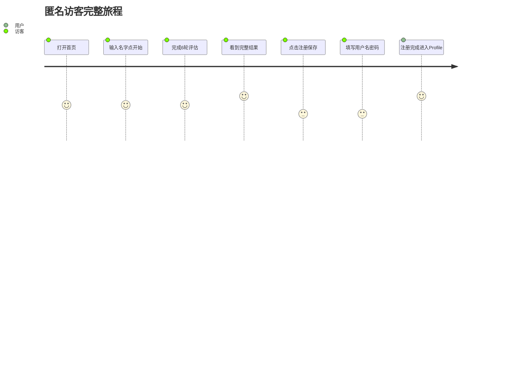

### 注册用户分享 → 对比 → Bond


### 匹配链接旅程

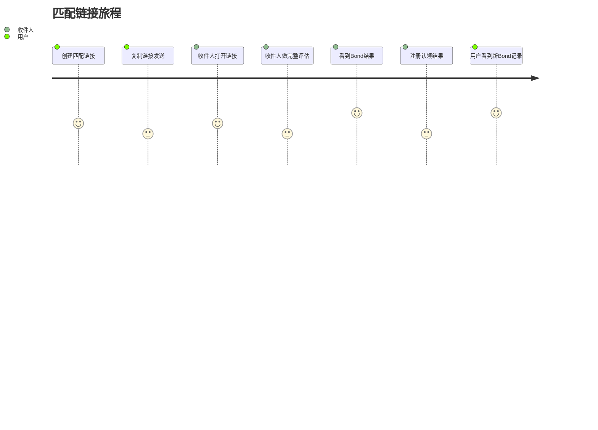

### 互评旅程

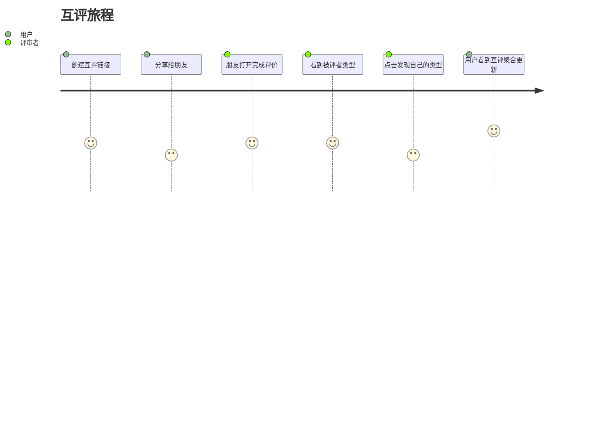

### SEO 搜索 → 起名报告（PRODUCT.md 旅程 1）

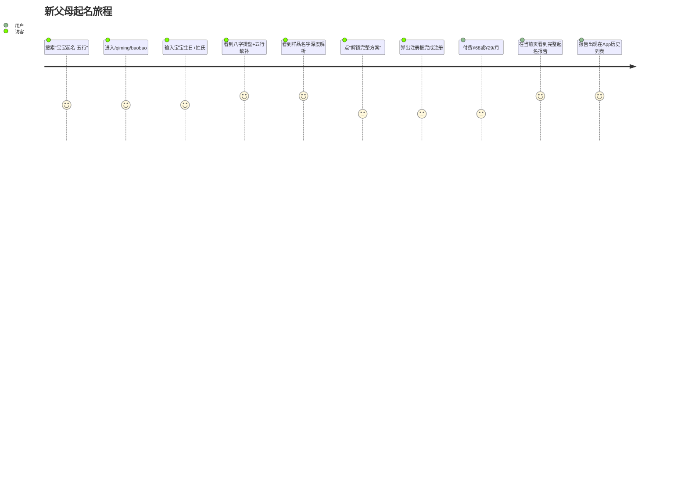

### SEO 搜索 → 关系报告（PRODUCT.md 旅程 2）

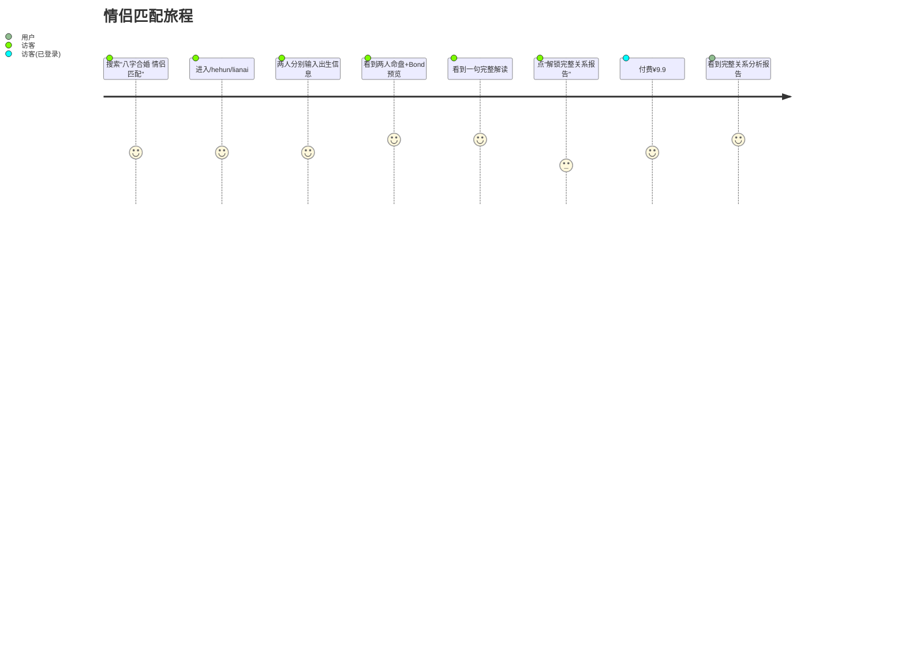

### 每日建议留存环

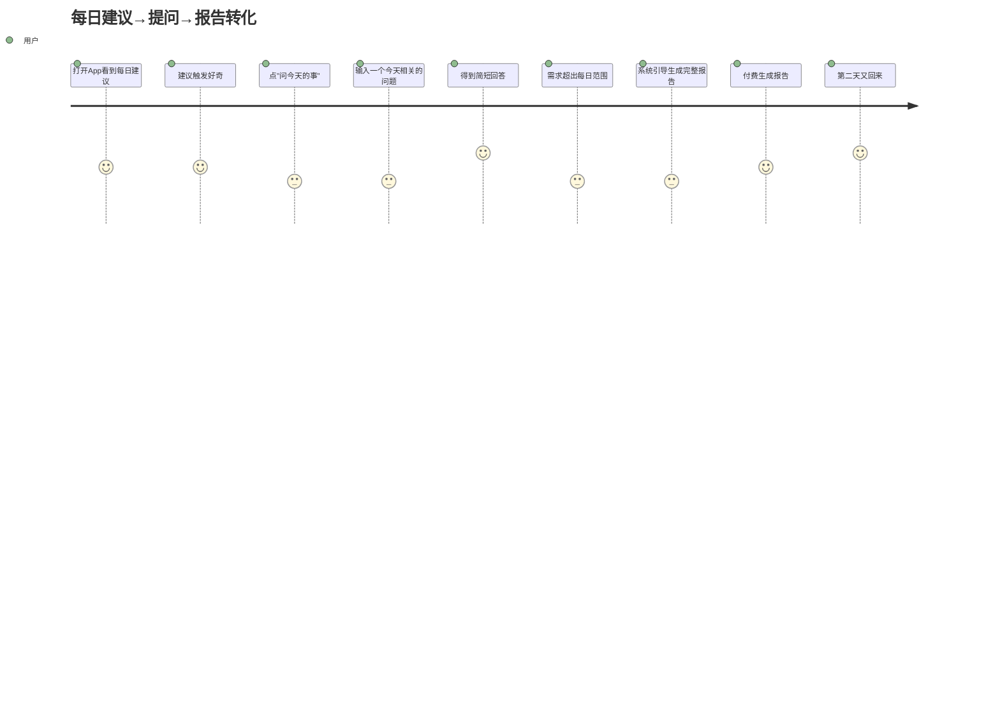

---

## 错误处理

所有 API 错误以统一 envelope 返回：

```json
{ "error": { "code": "invalid_request", "message": "human-readable detail" } }
```

### 错误码分流

| code | HTTP | 客户端行为 |
|------|------|-----------|
| `invalid_request` | 400 | 表单字段标红 + `details[].field` 逐字段提示（`details` 数组见 [appendix/errors](appendix/errors.md) §4） |
| `unauthorized` | 401 | 清除 localStorage token，跳转 `/login?redirect={当前路径}` |
| `token_expired` | 401 | 同 `unauthorized`，额外 toast"登录已过期，请重新登录" |
| `forbidden` | 403 | 展示"该用户未公开"页面 |
| `not_found` | 404 | 展示 404 页面 |
| `conflict` | 409 | 展示冲突提示（名称已存在 / 名称被保留） |
| `rate_limited` | 429 | 展示限流提示，读取 `Retry-After` header 显示倒计时 |
| `internal` | 500 | 展示通用错误提示 + 重试按钮 |

### 表单验证 details

`invalid_request` 响应可能携带 `details` 数组，客户端按 `field` 定位输入框：

```js
// API 返回: { error: { code: "invalid_request", details: [{ field: "name", code: "already_taken" }] } }
const err = data.error;
if (err.details) {
  err.details.forEach(d => {
    const el = document.querySelector(`[name="${d.field}"]`);
    if (el) el.classList.add('input-error');
  });
}
```

### 全局拦截

```js
// 所有 fetch 统一拦截 401
const origFetch = window.fetch;
window.fetch = async (...args) => {
  const res = await origFetch(...args);
  if (res.status === 401) {
    const body = await res.json().catch(() => ({}));
    const code = body?.error?.code;
    localStorage.removeItem('token');
    if (code === 'token_expired') showToast('登录已过期，请重新登录');
    window.location = '/login?redirect=' + encodeURIComponent(location.pathname);
  }
  return res;
};
```

---

## 前端错误采集

生产环境中 JS 运行时错误通过全局 `error` 事件收集：

```js
window.addEventListener('error', (e) => {
  if (!e.filename) return;
  const payload = {
    message: e.message,
    filename: e.filename.replace(location.origin, ''),
    lineno: e.lineno,
    colno: e.colno,
    stack: (e.error && e.error.stack) ? e.error.stack.slice(0, 1000) : '',
    url: location.pathname,
  };
  navigator.sendBeacon('/api/errors/frontend', JSON.stringify(payload));
});
```

### 设计决策

| 决策 | 理由 |
|------|------|
| `navigator.sendBeacon()` 而非 `fetch()` | 不阻塞页面卸载，页面跳转/关闭时也能送达 |
| stack 截断至 1000 字符 | 防止巨型堆栈占用请求体 |
| `e.filename` 为空时跳过 | 过滤跨域脚本错误（无有用信息） |
| POST 到 `/api/errors/frontend` | Go 后端新增 endpoint，写入 SQLite，每日上限 1000 条 |

---

## Caddy 健康检查

`Caddyfile` 配置了 `/healthz` 端点用于前端存活检测：

```caddy
handle /healthz {
    respond "ok" 200
}
```

- **用途**：Docker healthcheck 或外部监控（Uptime Kuma 等）验证 Caddy 静态文件服务正常
- **位置**：在 `encode gzip` 之前，避免对健康检查请求做压缩；在 Accept-Language 重定向之前
- **与后端健康检查分离**：`/healthz` 验证 Caddy 层面（root `/app/frontend/dist`），`/health` 验证 Go 后端

---

## Cloudflare 缓存规则

静态资源已通过版本指纹实现 cache busting（`app.ec39d8bc.js`），建议在 Cloudflare 控制台配置以下缓存规则：

| 规则 | 路径 | 缓存 TTL | 说明 |
|------|------|----------|------|
| 不可变资源 | `js/*.js` `css/*.css` | 1 年（immutable） | 指纹化文件名确保内容变更时 URL 变更 |
| HTML 页面 | `en/*.html` `zh-CN/*.html` | 不缓存（must-revalidate） | 确保用户总是拿到最新页面 |
| 图片/字体 | `img/*` `fonts/*` | 1 年 | 静态资源，路径不变则内容不变 |

### 配置建议

- **Cache Key**：包含完整 URL（含 query string），指纹化资源不需要额外配置
- **CDN 与 Caddy 协同**：Caddyfile 的 `Cache-Control` header 设置为 Cloudflare 提供了来源缓存信号
- **Bypass on Cookie**：Profile 页 `/profile/{name}` 建议 bypass 缓存（主人视图含敏感操作），避免返回他人的缓存页面

此配置需在 Cloudflare Dashboard → Rules → Cache Rules 中操作，非代码层面变更。

---

## 交互模式

所有交互由 Alpine.js 管理——表单提交、状态切换、条件渲染。API 调用通过 `api()` fetch wrapper。

### Alpine.js —— 组件内状态

```html
<!-- 五维滑块 -->
<div x-data="slider()" x-init="init()">
  <input type="range" x-model="wood" @input="recalc()">
  <!-- 实时更新距离面板 -->
</div>
```

```html
<!-- 语言切换 dropdown — 直接 <a> 链接到对应 locale 的同一页面 -->
<div x-data="{ open: false }">
  <button @click="open = !open">🌐</button>
  <ul x-show="open" @click.outside="open = false">
    <li><a href="/en/...">English</a></li>
    <li><a href="/zh-CN/...">中文</a></li>
  </ul>
</div>
```
语言切换通过 URL 路径导航（替换路径中的 locale 段），不再使用 `localStorage` + `reload`。`switchLang()` 仍保留在 common.js locale store 中，用于需要 JS 计算目标路径的场景。

### 模式选择

| 场景 | 用 |
|------|-----|
| 滑块、dropdown、toggle、tab | Alpine.js |
| 雷达图、折线图、河流图、图谱、Bond 力流 | ECharts |
| 页面布局、非交互内容 | 静态 HTML |

---

## 组件清单

### Nunjucks 组件库 (`_includes/`)

27 个可复用组件，消除页面间重复 HTML：

| 组件 | 文件 | 用途 |
|------|------|------|
| 页面壳 | `head.njk` | `<head>` 元数据、CSS、字体、Alpine CDN |
| 导航栏 | `navbar.njk` | 桌面导航 + 城市选择器 + 语言/主题/Auth |
| 导航栏（移动端） | `navbar-mobile.njk` | 移动端抽屉菜单 + 城市选择器 |
| 用户菜单 | `user-menu.njk` | 登录后用户下拉菜单 |
| 页脚 | `footer.njk` | 四栏链接 + Logo |
| Logo | `logo.njk` | 印章 + "25 Types" 文字标 |
| 静态内容页 | `static-page.njk` | 法律/营销页统一容器（`x-html="staticPage()"`） |
| 加载动画 | `loading-spinner.njk` | 居中 spinner + 可选加载文案 |
| 提交按钮 | `submit-button.njk` | 提交按钮 + loading spinner 双态 |
| 表单起始 | `form-start.njk` | `form.card > card-body` 统一外壳 |
| 表单结束 | `form-end.njk` | 错误行 + 闭合标签 |
| 错误页 | `error-page.njk` | 404/500 参数化错误页 |
| 答题卡片 | `assess-card.njk` | 评估页答题卡片 + 侧箭导航 + 进度 |
| 段落标题 | `section-header.njk` | 标题 + 单行描述的统一样式，通过 `` 传参，支持 `level` 参数切换 heading 级别 |
| Profile 卡片 | `profile-card.njk` | 雷达图 + identity badge + 类型描述（内联替代了 `element-radar.njk`） |
| Bond 卡片对 | `bond-pair.njk` | 双栏 Bond 影响卡片对（self + other），消除 5 处重复的 `bond-card.njk` 配对 |
| Bond 卡片 | `bond-card.njk` | 单张 Bond 影响雷达图 + identity badge + influencer + delta bars |
| Peer 区域 | `peer-section.njk` | Peer 雷达图（双系列叠加） |
| 流月区域 | `flow-section.njk` | 当前流月雷达图 + delta 条形图，可选 `desc` 参数 |
| 历史区域 | `history-section.njk` | 折线图容器，可选 `desc` 参数和 `badges` slot |
| 类型段落 | `type-section.njk` | 类型详情页 portrait/classical/growth 三段统一卡片，通过 `condition`/`titleKey`/`binding` 参数化 |
| 空状态 | `empty-state.njk` | 统一空数据/错误占位：标题 + 描述 + CTA 按钮，替代 5 处内联 empty state |
| CTA 横幅 | `cta-banner.njk` | 底部 CTA 区：按钮 + 可选 guarantee 文案 + border-t 分隔 |
| 图表容器 | `chart-container.njk` | 通用 ECharts 图表容器，支持 `dynamicId`（Alpine `:id`） |
| 元素条形图 | `element-bars.njk` | 五元素水平条形图 |
| 元素差异条形图 | `element-delta-bars.njk` | 五元素 delta 差异条形图 |
| Peer 差异条形图 | `peer-delta-bars.njk` | Peer vs self 元素差异条形图 |

### 全局组件

| 组件 | 模板文件 | 用途 |
|------|---------|------|
| 导航栏 | `navbar.njk` | 全站导航 + 登录状态 + 城市选择 + 语言切换 |
| 页脚 | `footer.njk` | 备案号 + 法律链接 + 语言切换 |
| 语言切换器 | `navbar.njk` 内 | `<a>` 链接到对应 locale 的同一页面路径，按 `page.url` 替换 locale 段 |

### 图表渲染

所有图表通过 `common.js` 的 `Charts` 命名空间渲染，无需独立 `charts.js` 文件：

| 函数 | 用途 | 使用页面 |
|------|------|---------|
| `computeBondShapes(bond)` | Bond 计算核心：从 bond JSON 提取 origSelf/origOther/pSelf/pOther + delta 数组，消除 3 个文件中的重复计算 | profile、match-landing、bond-history |
| `Charts.renderElementRadar(el, data, overrides)` | 五维雷达图（支持多系列叠加、legend、主题跟随） | result、profile、bond-card |
| `Charts.renderElementLine(el, data, overrides)` | 五元素折线图（支持 markPoint、markLine、面积填充） | profile（history） |
| `Charts.renderFlowRiver(el, months, currentIdx)` | 元素河流柱状图（五元素分组柱状图 + 生克箭头标记） | profile（flow-river）、home（demo） |
| `Charts.renderBondInfluenceChart(el, origData, pData, ...)` | Bond 影响雷达图（原始 vs 受影响双系列叠加），消除 4 处重复渲染调用 | profile、match-landing、bond-history |

图表配色通过 `Alpine.store('theme').getChartConfig()` 获取，自动跟随 daisyUI 主题。ECharts 通过 `loadECharts()` 按需加载。

### 编码模式

**chartCls save/restore** — Nunjucks `` 在 include 间共享可变作用域。`bond-card.njk`、`history-section.njk`、`flow-section.njk`、`peer-section.njk` 均会重写 `chartCls`。当它们嵌套在另一个 include（如 `bond-pair.njk`）中时，第二次调用会读到被污染的 `chartCls`。修复方式——在 include 入口保存、出口恢复：

```njk




```

**computedBond 缓存** — `computeBondShapes()` 被 getter 多次访问时重复计算。`match-landing.js` 通过 `_cachedBondShapes` 私有字段缓存结果，所有 getter 读取 `this.computedBond`。关键：在 `this.result = data` 之前必须置空 `this._cachedBondShapes = null`，否则旧缓存污染新数据。

**profile.js CRUD helpers** — `loadReviewLinks`/`loadMatchLinks`、`createReviewLink`/`createMatchLink`、`deleteReviewLink`/`deleteMatchLink` 六对方法参数化路径和字段名，收拢为三个私有 helper (`_loadLinks`/`_createLink`/`_deleteLink`)，公共方法退化为一行委托。

**Hardcoded color elimination** — 图表 label/markLine 中的硬编码色值（`'#fff'`、`'#999'`）改为 `Alpine.store('theme').dark ? '#1a1a2e' : '#fff'` 三元，跟随主题切换。Tailwind 硬编码颜色类（`text-yellow-400`）改为 daisyUI 语义类（`text-warning`）。

---

## 页面状态

每个页面定义三种状态：

```
空白态    — 无数据时的初始或 fallback
成功态    — 数据渲染
空数据态  — 请求成功但数据为空
```

```html
<!-- 模板示例：评估历史 -->
<div x-data="historyPage()" x-init="load()">
  <template x-if="loading"><span class="loading loading-spinner"></span></template>
  <template x-if="empty"><div>暂无评估记录，<a href="/assess">开始第一次评估</a></div></template>
  <template x-if="error"><div><p x-text="error"></p><button @click="load()">重试</button></div></template>
  <template x-if="items.length"><!-- 成功态 --></template>
</div>
```


---

## 多语言

### 翻译策略

每页只含当前语言数据。所有 `window.*` 全局变量为 flat 单语言结构（字符串值，不再嵌套 `{en, zh-CN}`）。

| 内容类型 | 机制 |
|---------|------|
| 类型描述/角色匹配 | `content/{locale}/types.yaml` → 构建时注入 `window.TYPES`（25 型数组） |
| 元素名称/描述/颜色 | `content/{locale}/elements.json` → 构建时注入 `window.ELEMENT_NAMES`（flat 字符串）/ `window.ELEMENT_COLORS` |
| UI 标签（按钮、提示） | `content/{locale}/translations.json` → 构建时注入 `window.TRANSLATIONS`（flat 键值） |
| 原型向量 | `configs/prototypes.json` → 运行时 fetch `/content/prototypes.json`（语言无关） |
| 法律文档/静态页 | `content/{locale}/*.md` → 构建时 markdown-it 渲染 → `window.PAGE_CONTENT`（flat 页面名→HTML） |
| 错误消息 | 服务端按 `X-Locale` 返回对应语言 |
| API 响应 label | 由 `X-Locale` header 决定，客户端从 `Alpine.store('locale').current` 传递 |
| 评估题库 | 后端 `GET /api/assessments/questions?locale=` serve |

### 语言检测

Caddy 在 `/` 根路径解析 `Accept-Language` header，302 重定向到 `/en/` 或 `/zh-CN/`。所有页面链接均含 locale 前缀，无需客户端嗅探。

### 页面语言范围

不是所有页面都需要双语言构建。按需求存在性分三类：

| 范围 | 构建策略 | hreflang | 语言切换 |
|------|---------|----------|---------|
| **双语** | Eleventy 双语言各构建一份，`permalink: "/{{ site.locale }}/..."` | 双向 alternate（en↔zh-CN） | 正常切换 |
| **仅中文** | permalink 写死 `/zh-CN/...`，或 frontmatter `locales: [zh-CN]` | 仅 canonical，不标注英文 alternate | 英文站切换到该路径时回首页 |
| **仅英文** | permalink 写死 `/en/...`，或 frontmatter `locales: [en]` | 仅 canonical，不标注中文 alternate | 中文站切换到该路径时回首页 |

**仅中文页面**（~18 个）：八字/起名/合婚/择日/职业 SEO 落地页。英文世界不存在对应搜索需求——不做英文 SEO 内容。但英文版保留工具壳（`/en/mingli/bazi` 等）——海外华人用英文 UI 时仍可用 Demo，只是页面不含 structured content、不做 SEO targeting。

**仅英文页面**（4 个）：`/en/career`、`/en/compatibility`、`/en/naming/baby`、`/en/naming/chinese-name`——中文世界没有对应搜索行为。

**双语页面**（~14 个）：品牌页、评估、类型、认证、Profile、法律——中英文各一份完整内容。首页内容不同（中文突出八字/起名、英文突出 personality/relationships），但同属一个模板。

### Eleventy 构建适配

当前 Eleventy 通过 `LOCALE` 环境变量做两次完整构建。需要增加 frontmatter 控制：

```yaml
# 仅中文页面
locales: [zh-CN]
permalink: "/zh-CN/mingli/bazi.html"

# 仅英文页面
locales: [en]
permalink: "/en/career.html"
```

构建脚本在 `build:html:en` 时跳过 `locales: [zh-CN]` 的页面，在 `build:html:zh-CN` 时跳过 `locales: [en]` 的页面。

### SPA scene 可用性

`/app#ask` 报告系统按用户 locale 限制可选 scene（详见 [PRODUCT.md](PRODUCT.md) §11）。前端通过 `Alpine.store('locale').current` 判断展示哪些 scene 入口。

---

## SEO

### 多语言 URL 结构

公开页面采用 locale 路径前缀——`/en/types/WF`、`/zh-CN/types/WF`。这是 Google 推荐的多语言 URL 模式，确保每个语言版本有独立 URL 可被分别索引。

首页 `/` 通过 Caddy `Accept-Language` 嗅探 302 重定向到 `/en/` 或 `/zh-CN/`。不做无前缀路径——所有语言版本均有显式 locale 前缀。

### 静态页面架构

不设服务端渲染。所有页面为静态 HTML + JS fetch：

- **类型详情页**（`/{locale}/types/{id}`）：构建时预生成静态 HTML，含完整内容。SEO 标签嵌入 HTML。
- **Profile 页**（`/profile/{name}`）：静态 HTML 壳 + JS fetch `/api/profiles/{name}` 取数据渲染。OG 图片在每日 sitemap 重生成时预构建（基于 p 向量画雷达图 + identity 标签），个性化预览无需 SSR。
- **他评入口**（`/r/{token}`）：静态 HTML 壳 + JS fetch `/api/r/{token}` 获取链接状态和推荐题目。OG 标签使用社交化文案，JS 获取链接信息后动态设置 `document.title`。
- **匹配入口**（`/m/{token}`）：静态 HTML 壳 + JS fetch `/api/m/{token}` 获取链接状态，OG 标签使用社交化文案。

### Meta 与结构化数据

类型详情页输出独立 `<title>`、`<meta name="description">`、`og:title`、`og:description`、`og:image`（构建时生成），按 locale 填充。

Profile 页 OG 图片每日构建时预生成（基于 p 向量雷达图 + identity 标签），不依赖 SSR。`og:title` 含 identity label：`"{label} -- 25 Types"`。

`/r/{token}` 使用社交化 OG 标签——不出现人名（构建时未知），但暗示社交场景：
- `og:title`：`"Someone wants you to discover their type -- join them"` / `"有人想让你发现自己的类型——来一起"`
- `og:description`：`"Complete a quick review and see their elemental profile"` / `"完成几道简短的选择题，看看 ta 的元素配置"`
- JS fetch 链接信息后将 `document.title` 设为 `"{subject_name} -- 25 Types"`（浏览器标签页显示人名）

**hreflang**：双语页面在 `base.njk` 中构建时注入自身和兄弟语言版本的链接。例如 `/en/types/WF` 输出：

```html
<link rel="canonical" href="https://25types.com/en/types/WF/index.html">
<link rel="alternate" hreflang="en" href="https://25types.com/en/types/WF/index.html">
<link rel="alternate" hreflang="zh-CN" href="https://25types.com/zh-CN/types/WF/index.html">
```

仅中文/仅英文页面不输出 `alternate` 标签——不存在的语言版本不该被搜索引擎抓取。

自身 locale 和 alternate locale URL 通过 Nunjucks `replace()` filter 从 `page.url` 动态生成。

**Canonical**：每个页面标注 `<link rel="canonical" href="...">`，防止参数和尾斜杠导致的重复索引。

**结构化数据**：25 型详情页嵌入 JSON-LD `DefinedTerm` + `BreadcrumbList`（`Home > Types > 木火通明`），Profile 页嵌入 `Person`，指向对应类型。

### Sitemap 与 Robots

构建时生成静态 `/sitemap.xml`，含全部公开页面——类型页 x 25 x 2 (en/zh-CN)、所有公开 Profile 页。部署时写入磁盘，每日凌晨定时重生成一次。请求始终返回磁盘文件，零运行时查询。`/robots.txt` 指向 sitemap。

### URL 规范

静态文件路径稳定不变。业务页面的任何重命名或移动均设置 301。自定义 404 页面返回有用导航链接，不返回空白页。

### OG 图片自动生成

每个公开页的 `og:image` 图片在构件时生成静态 PNG，存至 content 目录：

- **类型页**（25 个 x 2 locale = 50 张）——五行色块 + 类型名 + 一句话描述
- **Profile 页**——比例条形图（从 p 向量）+ identity 标签。每日凌晨随 sitemap 一并重新生成

图片尺寸 1200x630，Google Discover 推荐比例。`og:image` URL 带内容哈希以支持版本化。

### Core Web Vitals

所有公开页面性能目标：

| 指标 | 目标 | 说明 |
|------|------|------|
| LCP | < 2.5s | 最大内容绘制——首屏文字应首先渲染 |
| FID | < 100ms | 首次输入延迟——骨架标签不阻塞交互 |
| CLS | < 0.1 | 累计布局偏移——预留图片和图表尺寸，避免加载后跳动 |

25 型图谱的 SVG/Canvas 渲染不得阻塞首屏文字（`loading="lazy"` 或 `decoding="async"`）。公开页面首次加载不依赖客户端 JavaScript 即可显示完整内容。

验收：
- [ ] 公开页面 curl 返回完整 HTML（含可抓取文本），非空白壳
- [ ] 每页有独立 `<title>` 和 `<meta description>`
- [ ] 每页有 `<link rel="alternate" hreflang="...">` 标注所有语言版本
- [ ] 每页有 `<link rel="canonical" href="...">`
- [ ] 25 型详情页 JSON-LD 通过 Google 结构化数据测试工具验证
- [ ] `/sitemap.xml` 含全部公开页面，返回 `Content-Type: application/xml`
- [ ] 404 页面返回有用导航，HTTP 状态码 404
- [ ] Content 文件内容变更时旧 URL 301 -> 新 URL

---

## 性能目标

| 指标 | 目标 | 方法 |
|------|------|------|
| 预构建页面 LCP | < 1.5s | 类型详情页预构建静态 HTML，Caddy 直出 + CDN |
| 图表页面 LCP | < 2.5s | 图表 JS 动态 import，骨架屏 |
| 总 CSS 体积 | < 10KB (gzip) | Tailwind purge + 自定义样式 |
| CLS | < 0.1 | 预留图表容器尺寸，img 显式宽高 |

---

## 兼容性

| 浏览器 | 版本 | 说明 |
|--------|------|------|
| Chrome | 最近两个大版本 | 主要测试目标 |
| Firefox | 最近两个大版本 | |
| Safari | 最近两个大版本 | iOS Safari 主要影响移动端 ECharts 交互 |
| Edge | 最近两个大版本 | Chromium 内核，同 Chrome |

不支持 IE。移动端优先响应式（Tailwind `sm/md/lg/xl`）。

### 验收

- [ ] Lighthouse Performance > 90（桌面端），> 70（移动端 4G 限速）
- [ ] 预构建页面 LCP < 1.5s
- [ ] 普通页面 LCP < 2.0s
- [ ] 图表页面 LCP < 2.5s
- [ ] 总 JS gzip < 150KB
- [ ] 总 CSS gzip < 10KB
- [ ] CLS < 0.1
- [ ] Chrome/Firefox/Safari/Edge 最近两个大版本手动过一遍核心流程
- [ ] iOS Safari 移动端 ECharts 图表交互正常（雷达图拖拽、河流柱状图横滑）

---

## 可访问性

当前实现基线：语义化 HTML（`<nav>`、`<main>`、`<footer>`）、skip link、ARIA 标注（移动端菜单 `aria-expanded`、进度条 `aria-label`、加载中 `aria-busy`、图表 `role="img"`）、表单 label 关联。深色主题对比度在 OKLCH 下通过 WCAG AA。

**已实施**：
- skip-to-main link：每页 `<body>` 顶部隐藏链接，focus 时可见
- 移动端汉堡菜单：`:aria-expanded="mobileOpen"` + `aria-controls` + `aria-label`
- 进度条：`aria-label`
- 加载态：`aria-busy="true"` + spinner `role="status"`
- 雷达图：ECharts 渲染，容器含 `aria-label`（动态生成含身份名称的描述）
- 评估选项按钮：disabled 状态通过 `.sel-dimmed`（`opacity: 0.3; pointer-events: none`）视觉传达

**待补充**：
- 键盘导航：图表交互不可用键盘操作（ECharts 默认不支持）
- 屏幕阅读器测试：未用 VoiceOver/NVDA 实测
- 颜色对比度审计：Metal 灰色 `#E0E0E0` 在深色背景上的对比度可能不达标

---

## 图表 UX 规范

### 色板

五行元素色板跟随主题切换，通过 `Alpine.store('theme').colors` 和 `getChartConfig()` 获取。两套主题色值见 §daisyUI 主题配置 中的 `--wood` ~ `--water` CSS 变量。

暖亮主题图表：透明背景 + 深色网格线。暗色主题图表：`#1a1a2e` 背景 + 浅色网格线。

### 全局规则

| 规则 | 说明 |
|------|------|
| 主题跟随 | 图表配色从 `Alpine.store('theme').getChartConfig()` 获取，跟随 daisyUI 主题 |
| 入场动画 | 雷达图 600ms cubicOut 展开，其他图表 400-800ms |
| ECharts 集成 | `echarts.init(this.$refs.dom)` + `setOption()` 更新，不重建 DOM |
| 响应式 | `ResizeObserver` + `window resize` 监听 → `chart.resize()`，移动端简化布局 |

> **当前实现状态**：ECharts radar、line、bar 图表通过 `Charts.renderElementRadar()`、`Charts.renderElementLine()` 和 `Charts.renderFlowRiver()` 渲染。图表集中在结果页、Profile 页和 25 型浏览器。Bond 力流图复用双雷达叠加模式。

### 各图 UX

#### 雷达图（全站灵魂图）— 已实现

- 渲染：ECharts radar，五轴五边形，暗底 + 网格线 `rgba(255,255,255,0.06)`
- 入场：600ms cubicOut 展开，数据多边形渐变填充
- 轴标签：五行元素全名 + 对应颜色，tooltip 显示 d/p 精确值
- 双系列叠加：d（self）实线 + p（peer）虚线菱形标记
- 空雷达（无数据时）显示五边形骨架

#### 25 型关系图谱 — 已实现

- 渲染：ECharts graph force 布局，节点可拖拽回弹
- 纯元素节点大（32px），复合节点小（18px），连线：金色=生，红色虚线=克
- 交互：点击节点跳转详情页，hover 高亮邻接节点

#### 河流图（历次变迁）— 已实现

- 渲染：ECharts line 堆叠面积图，五色渐变填充
- X 轴为评估日期，Y 轴为 d 值，legend 可切换元素显示
- 无历史数据时展示空态引导

#### Bond 力流图 — 已实现

- 渲染：双 ECharts radar（自评 + 对方）+ 元素流折线对比图
- 五元素折线对比：自评绿色实线 vs 对方青色虚线，面积渐变填充
- Delta 向量面板显示双方元素差异

#### 12 月折线图 — 已实现

- 渲染：ECharts bar 分组柱状图，5 个节气月为 X 轴（前一月、当前月、后三月），每月 5 根柱（五元素）
- 柱高 = 用户基础比例（不随月份变化），柱色 = 元素主题色
- ↑ 金色箭头 = 该元素本月被生（nourished），↓ 灰色箭头 = 该元素本月被克（restrained）
- 当前月以竖虚线标记，legend 可切换元素显示
- 数据来源：`GET /api/flow/yearly`，仅返回方向索引（generates/restrains），不返回数值偏移
- 统一函数 `Charts.renderFlowRiver(el, months, currentIdx)`，首页和 profile 页共用

#### 距离面板 — 已实现

- 渲染：ECharts bar 水平柱状图，最近类型=用户 identity 色高亮，其余=半透明白
- Y 轴按距离排序，label 显示精确 score，tooltip 显示分数
- 结果页加载后渲染，显示用户与 25 个原型向量的距离排序

### 动画规范

| 类型 | 时长 | easing |
|------|------|--------|
| 图表入场 | 600ms | `cubic-bezier(0.34, 1.56, 0.64, 1)` |
| morph 过渡 | 400ms | `cubic-bezier(0.4, 0, 0.2, 1)` |
| hover 响应 | 150ms | `ease-out` |
| 粒子动画 | 持续 | requestAnimationFrame 循环 |
| 数值变化 | 800ms | `cubic-bezier(0.4, 0, 0.2, 1)` -- 更新数据时旧值渐变为新值 |

### 移动端适配

| 图表 | 桌面 | 移动 |
|------|------|------|
| 雷达图 | 五边形，轴标签外置 | 缩小 + 轴标签缩写或仅图标 |
| 关系图谱 | 力导向全节点 | 仅显示选中节点 + 最近邻，滑动浏览 |
| 河流图 | 全宽时间轴 | 垂直滚动，每次显示 3 次评估 |
| Bond | 左右双圆 | 上下双圆，力线缩短 |
| 河流柱状图 | 全宽 5 月 | 横滑，每次 3 月 |

---


---

## 页面流转图

### 全站导航骨架

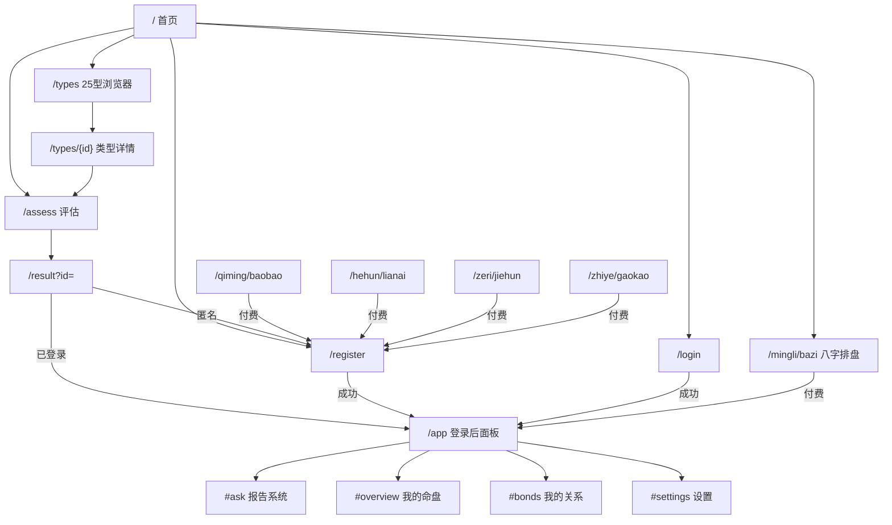

### 认证流程

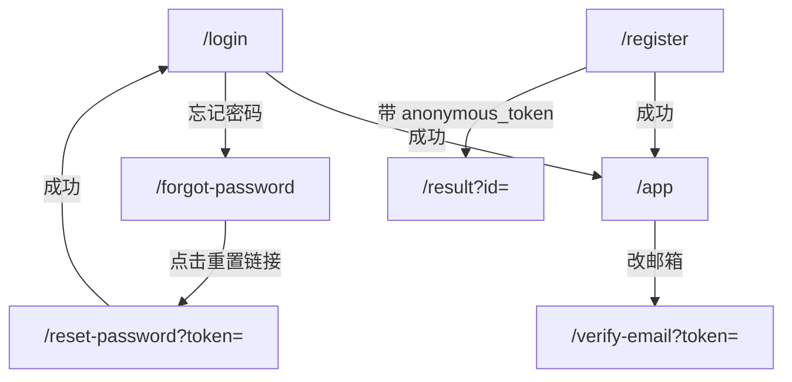

### 评估流程

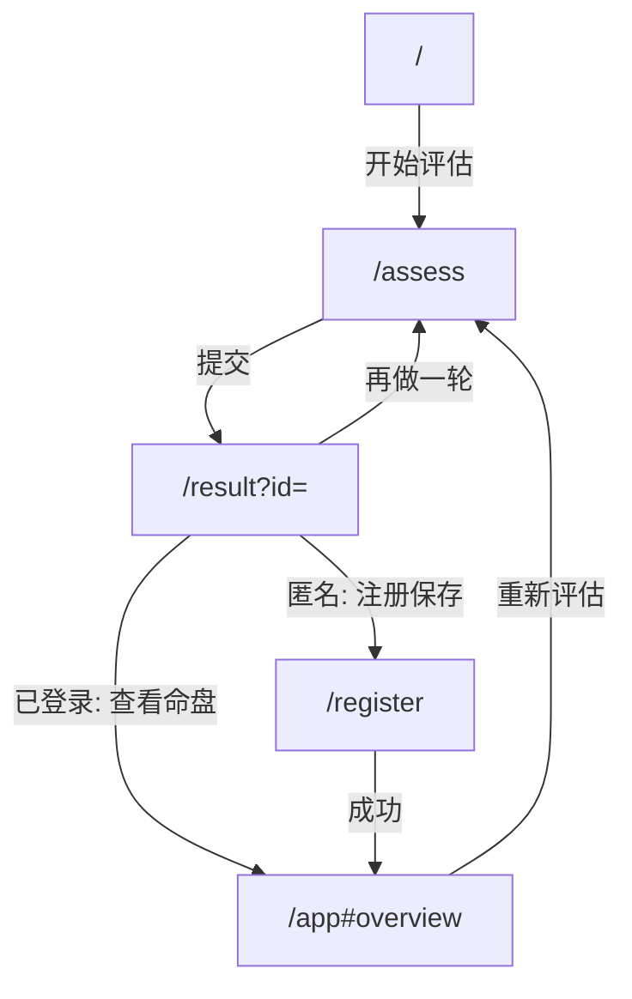

### SEO 落地页 → 报告转化（通用模式）

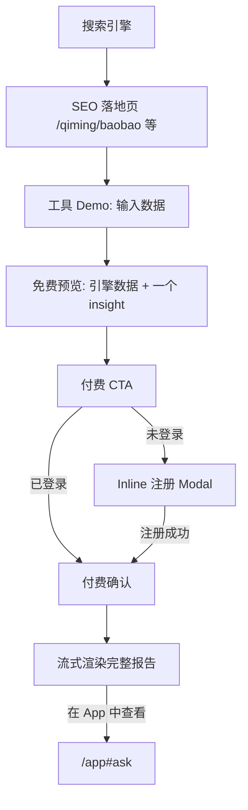

### App 壳视图切换（`/app`）

```mermaid
stateDiagram-v2
    [*] --> Default: 打开 /app
    Default --> Ask: 默认渲染（每日建议+报告列表+输入框）
    Ask --> Ask: 新问题→流式渲染报告
    Ask --> Ask: 点击历史报告→阅读器
    Ask --> Ask: 修改重问→PUT 更新
    Default --> Overview: 导航"我的命盘"
    Default --> Bonds: 导航"我的关系"
    Default --> Settings: 导航"设置"
    Overview --> Default: 返回报告
    Bonds --> Default: 返回报告
    Settings --> Default: 返回报告
```

### 结果页 `/result`（更新：已登录流程）

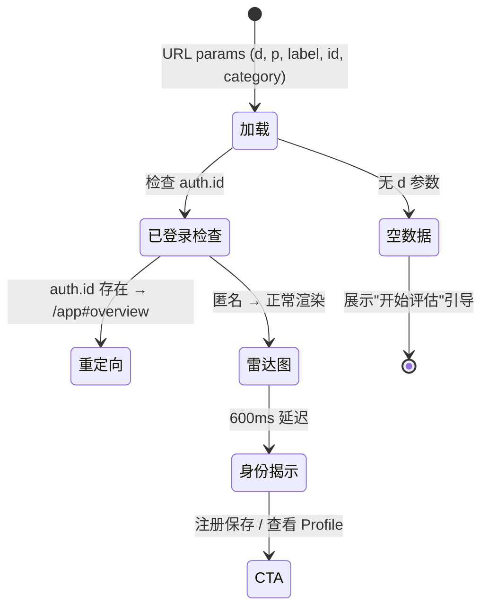

**结果页的新角色：** 不再是终点——是匿名用户的"展示 + 转化"页。已登录用户做完评估直接进入 `/app#overview` 查看命盘。匿名用户看到结果后引导注册，注册成功进入 App。

### 他评流程

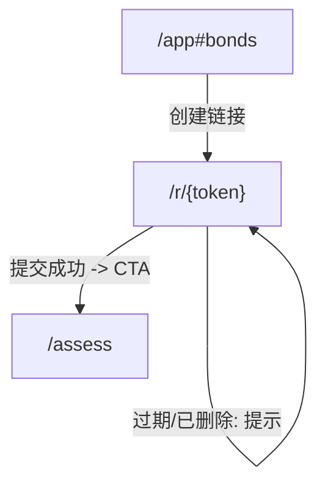

### Match Link 流程

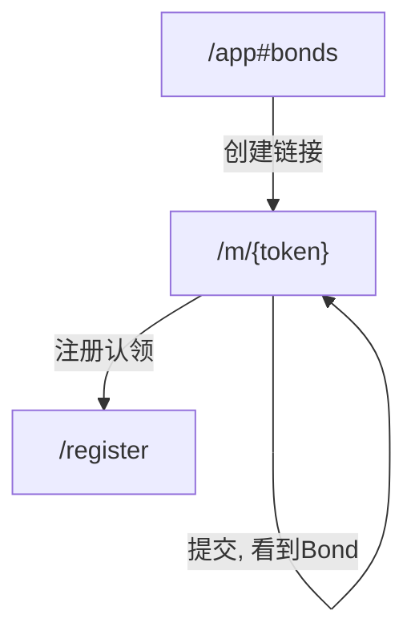

### App 内操作入口

```mermaid
graph TD
    App["/app (默认 #ask)"]
    App -->|"新问题"| NewReport["流式渲染新报告"]
    App -->|每日建议| DailyQ["每日提问(限3次)"]
    DailyQ -->|超出范围| NewReport
    App -->|导航"我的命盘"| Overview["#overview 八字+25types"]
    App -->|导航"我的关系"| Bonds["#bonds Bond列表+匹配链接"]
    App -->|导航"设置"| Settings["#settings 编辑/隐私/导出/注销"]
    Overview -->|重新评估| Assess["/assess"]
    Bonds -->|创建匹配链接| MatchLink["/m/{token}"]
    Bonds -->|创建互评链接| ReviewLink["/r/{token}"]
    Bonds -->|即时对比| BondModal["Bond 弹窗"]
```

### 评估页 `/assess`

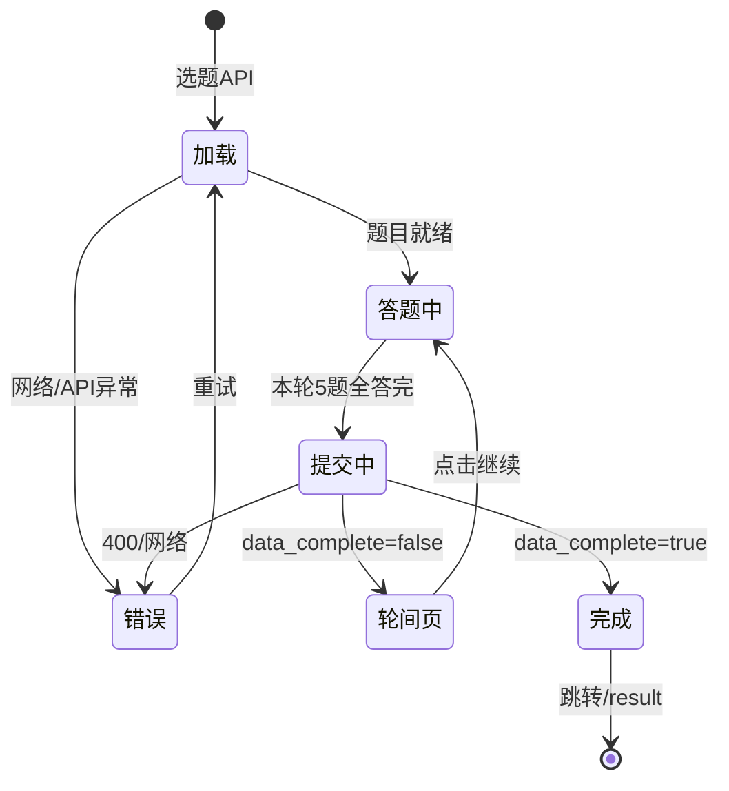

**轮间页（interstitial）**：每轮提交后若评估未完成，展示本轮元素画像（5 条水平柱状图，各着元素色，700ms ease-out 动画展开）+ "继续"按钮。制造 anticipation——让用户看到部分结果，激发完成全部 6 轮的欲望（Zeigarnik 效应）。

### 他评入口 `/r/{token}`

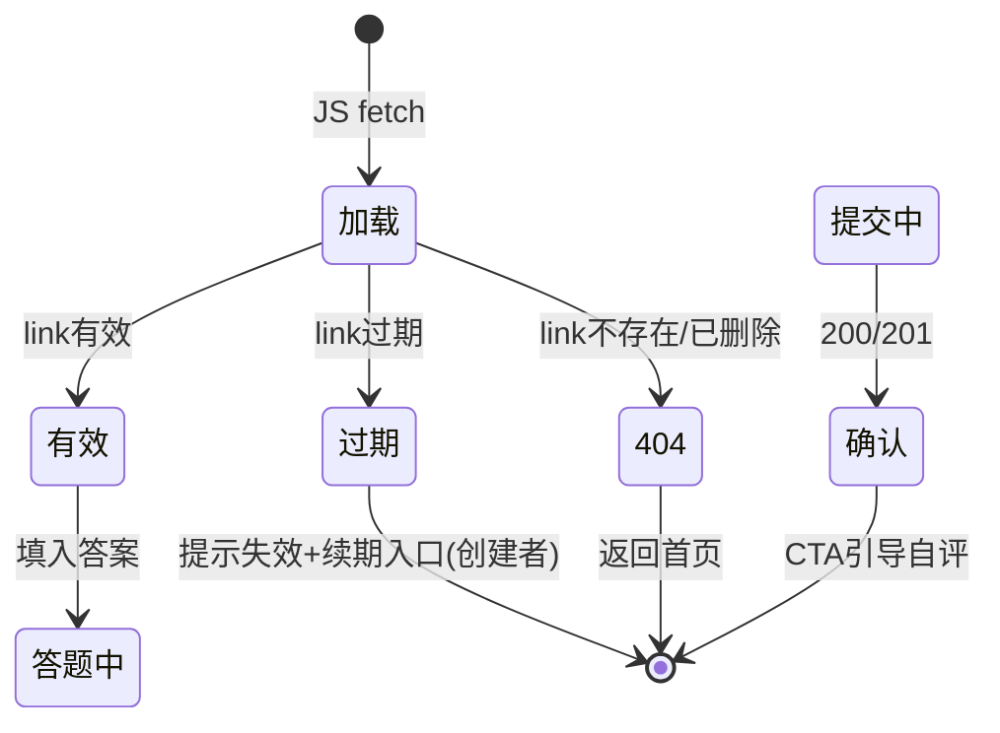


## 已知权衡

| 权衡 | 决策 | 代价 |
|------|------|------|
| JWT 存 localStorage | 简化无状态 API，不设 HttpOnly cookie | XSS 可读 token |
| 暖亮默认 + 暗色备选 | 新中式宣纸底暖亮主题为默认，暗色保留为备选 | 两套主题色值需分别维护，图表需 theme-aware |
| MPA 纯静态 | 每页独立 HTML，SEO 友好 | 页面间共享 HTML 通过 Nunjucks `_includes/` 组件（27 个）消除重复 |
| ECharts 图表 | 稳定成熟的图表库，暗色辉光主题 | ~232KB gzip（esbuild 定制仅含 5 类图表），仅图表页面按需加载 |
| 评估 6 轮 3 选 2 设计 | 每个问题 3 选项选 2 个（FIFO 替换第 3 个） | 交互非标准，需视觉引导（已补 dim + flash） |
| Nunjucks `` 共享可变作用域 | include 间通过 `` 传参，零开销 | 嵌套 include 会污染外层变量（如 `chartCls`），需 save/restore 模式规避 |
| 匿名优先 | 降低参与门槛，评估后注册 | 匿名进度仅 sessionStorage，换设备/浏览器即丢失 |

---

> **纯静态 HTML。Alpine.js 管交互，ECharts 管图表。Go 只管 JSON。Caddy 管全部前端。**

## 参见

- [INDEX](INDEX.md) 路由总览与共享内核
- [API](API.md) HTTP 契约
- [appendix/errors](appendix/errors.md) 错误码完整参照
